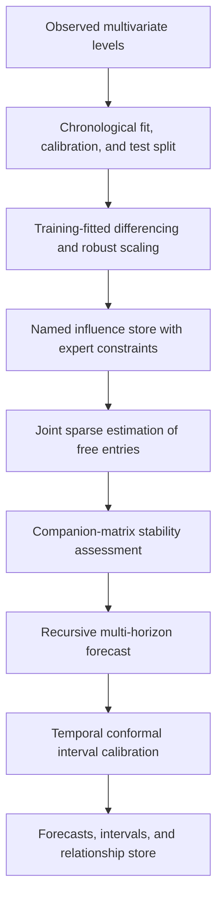

# QNTUM: A Quantified Network of Temporal Unfolding Magnitudes for Interpretable, Editable Multivariate Forecasting

Ayoub Bensakhria
Yoctobe Ltd
Liverpool, L1 0AH, United Kingdom
ayoub.bensakhria@yoctobe.com

---

## Abstract

Small coupled systems often require data-driven estimation together with exact expert control over a limited set of relationships. Restricted and sparse multivariate methods support coefficient constraints, but their fitted structures are not ordinarily exposed as a unified set of locally editable relationship objects with scenario timing and stability metadata. QNTUM (QUAntified Network of Temporal Unfolding Magnitudes) addresses this operational requirement through a sparse influence store. Each entry records a target, one or more sources, a coefficient or formula, an integer lag, and a constraint state. Expert entries may be fixed, sign-constrained, bounded, or forbidden; all free entries are estimated jointly. Variables may be gated by explicit inactive, formation, stable, and decay phases. Levels are represented internally as robustly standardized increments, with preprocessing fitted on training observations only. Linear lagged dynamics are assessed through their companion matrix, and predictive intervals use chronological conformal calibration. In 1,800 controlled sparse-system fits, 50% correct pin coverage increased mean support F1 from 0.711 to 0.786 at 80 observations and from 0.817 to 0.905 at 320 observations. Six-step forecast MAE changed by less than 1%. On two observed UCI panels, QNTUM performed similarly to zero-increment and vector autoregressive baselines. The results support QNTUM as an interpretable, editable representation whose demonstrated benefit is structural recovery under correct partial knowledge rather than general forecasting superiority.

**Keywords:** multivariate time series, interpretable forecasting, constrained vector autoregression, sparse system identification, influence networks, event dynamics, spectral stability, conformal prediction.

---

## 1. Introduction

### 1.1. The problem: coupling structure that can be read, edited, and bounded

A forecaster working with interacting series may possess reliable knowledge about a few relationships and little knowledge about the remainder. Three requirements follow.

First, the fitted coupling structure should be readable. The analyst must be able to identify which variable influences which target, with what sign and lag.

Second, the structure should be editable. Trusted relationships should remain fixed when the remaining coefficients are estimated, while impossible relationships should be excluded.

Third, recursive dynamics should be bounded by a condition that applies to the transition actually executed by the model. A lag-free check is insufficient when fitted relationships contain lags.

Restricted vector autoregressions can impose coefficient restrictions [1], [2], sparse VAR estimators reduce dense coefficient sets [3], [4], and sparse system-identification methods select compact nonlinear terms [5], [6]. QNTUM combines these ideas in an explicit influence store intended for inspection and scenario editing.

### 1.2. What QNTUM is

QNTUM evolves one standardized increment per variable in discrete time. Relationships are stored as named entries containing a target, one or more sources, an integer lag, a feature, a coefficient, an admission score, and a constraint status. Expert entries may be fixed, sign-constrained, bounded, or forbidden. Free entries are selected and estimated jointly.

Each target may also carry an event envelope with inactive, formation, stable, and decay phases. The envelope controls when incoming influence is active. Linear lagged dynamics are assembled into a companion matrix for stability assessment. Forecast intervals are calibrated on a chronological segment that is separate from the final test period.

### 1.3. Contributions

1. **A named influence store** in which individual relationships carry explicit sources, targets, lags, coefficients, and constraint states.
2. **Exact expert constraints** supporting fixed values, signs, intervals, and forbidden edges.
3. **Joint sparse estimation** of unconstrained entries, avoiding independent marginal coefficient fits.
4. **Lag-aware stability assessment** through the companion matrix of the fitted linear recurrence.
5. **A chronological evaluation protocol** covering recursive forecasts, transparent baselines, interval coverage, incorrect-pin sensitivity, and reproducible experiment artifacts.

The remainder of the paper follows the original QNTUM structure. Section 2 places the model against the methods from which it draws. Section 3 defines the model formally and explains each object in plain language. Section 4 evaluates known-ground-truth systems, observed panels, and stability. Section 5 discusses the operating range and limitations. Section 6 concludes and identifies the next empirical requirements.

---

## 2. Background

QNTUM lies at the intersection of multivariate forecasting, sparse system identification, event dynamics, robust preprocessing, and predictive uncertainty.

### 2.1. Linear multivariate forecasting

Vector autoregression represents each variable as a function of lagged values of all variables [1], [2]. Equality restrictions can fix selected coefficients, and the companion-matrix eigenvalues determine stability for a linear VAR. QNTUM retains this linear foundation but exposes each nonzero coefficient as a named relationship object.

### 2.2. Sparsity and system identification

The lasso introduced coefficient sparsity through regularization [3]. Structured sparse VAR estimators extend this principle to multivariate lag models [4]. SINDy and SR3 recover compact dynamical equations from candidate functions [5], [6]. QNTUM uses a smaller candidate library of pair, product, and declared formula terms. Its distinguishing feature is the constraint and editing metadata retained with every selected term.

### 2.3. Event dynamics

Hawkes processes use decaying kernels to represent fading event influence [7]. QNTUM does not model event-arrival intensity. It uses a deterministic phase envelope to specify when a target responds to the relationships already stored in the model.

### 2.4. Deep probabilistic forecasting, and why this model does not compete with it

DeepAR and related global models learn across large collections of related series and provide probabilistic forecasts [8]. The M4 results also show that carefully applied statistical and hybrid methods remain competitive across heterogeneous forecasting tasks [9]. QNTUM addresses a different operating regime: small coupled systems in which individual relationships must remain visible and editable. Its value must therefore be judged against constrained and sparse interpretable baselines, not against large-panel representation learning alone.

### 2.5. Robust preprocessing and resampled uncertainty

Median and median absolute deviation provide outlier-resistant location and scale estimates [10]. QNTUM applies these statistics to training increments only. Predictive uncertainty is evaluated with chronological conformal calibration [11], [12]. Time dependence weakens exchangeability-based guarantees, so empirical coverage is reported on untouched test observations.

### 2.6. The gap

**Table 1.** Relationship between QNTUM and neighbouring approaches.

| Approach | Established capability | QNTUM representation |
|---|---|---|
| Restricted VAR [1], [2] | Linear lagged coupling and exact restrictions | Named local constraints and editable entries |
| Sparse VAR [3], [4] | Joint regularized coefficient estimation | Sparse coefficients retained as relationship objects |
| SINDy and SR3 [5], [6] | Nonlinear candidate libraries and sparse recovery | Small product/formula library with entry metadata |
| Event models [7] | Time-localized and decaying influence | Deterministic target-response envelope |
| Deep/global forecasting [8], [9] | Accuracy and uncertainty at panel scale | Different operating regime |
| Robust/conformal methods [10]-[12] | Robust scaling and empirical coverage | Training-only scaling and chronological calibration |

QNTUM is therefore an integration and representation contribution. Its empirical question is whether exact partial knowledge improves structural recovery without sacrificing forecast performance.

---

## 3. Methodology

### 3.1. Overview



**Figure 1.** QNTUM estimation and evaluation workflow.

Each stage is presented first as a formal definition and then in plain language.

### 3.2. Events and the phase function

Each target event $E_i$ is defined by a start time $t_0$, formation duration $t_f$, stable duration and decay constant $\tau$, initial magnitude $M_i(t_0)$, and drift $B_i$.

**Table 2.** Event parameters.

| Symbol | Meaning |
|---|---|
| $t_0$ | Event start time |
| $t_f$ | Formation duration |
| $\tau$ | Stable duration and decay constant |
| $B_i$ | Constant drift |
| $M_i(t_0)$ | Initial magnitude |

The phase function is

$$
\Phi_i(t)=
\begin{cases}
0, & t<t_0,\\
(t-t_0)/t_f, & t_0\leq t<t_0+t_f,\ t_f>0,\\
1, & t_0+t_f\leq t<t_0+t_f+\tau,\\
e^{-(t-t_0-t_f-\tau)/\tau}, & t\geq t_0+t_f+\tau,
\end{cases}
$$

with $t_f\geq0$ and $\tau>0$.

**In plain words.** Incoming influence is inactive before $t_0$, rises linearly during formation, remains fully active for $\tau$ steps, and then decays exponentially. The source state is retained; only the target response is gated. Event timing is declared rather than discovered.

### 3.3. Magnitude dynamics

Let $M(t)\in\mathbb{R}^n$ denote the standardized increment vector. One update is

$$
M_i(t+1)
=
b_i
+\alpha M_i(t)
+\beta\Phi_i(t)u_i(t)
+B_i.
$$

The total incoming influence is

$$
u_i(t)
=
\sum_{R:\mathrm{target}(R)=i}
w_R g_R\!\left(M_J(t-\ell_R)\right).
$$

The experiments set $\alpha=0$ and estimate persistence through named self-relationships. The initial global gain is $\beta=1$ and may be reduced by stability projection.

**In plain words.** The next change combines an intercept, optional memory, event-gated incoming relationships, and declared drift. Each relationship reads the required source values at its stored lag and contributes through its stored feature and coefficient.

### 3.4. The influence store

A relationship entry is

$$
R=(i,J,\ell,g,w,q,c),
$$

where $i$ is the target, $J$ is the source tuple, $\ell$ is an integer lag, $g$ is a feature, $w$ is its coefficient, $q$ is its admission score, and $c$ is its constraint state.

**Fixed coefficient**

$$
w=w_{\mathrm{expert}}.
$$

**Sign-constrained coefficient**

$$
w\geq0
$$

or

$$
w\leq0.
$$

**Bounded coefficient**

$$
a\leq w\leq b.
$$

A forbidden entry is excluded from the candidate set. An estimated entry is selected and fitted from training data.

For each target, candidate features form a design matrix $G_i$. Free coefficients are fitted jointly:

$$
\min_{b_i,w_i}
\frac{1}{2T}
\left\|
M_{i,2:T}-b_i\mathbf{1}-G_iw_i
\right\|_2^2
+\lambda\left\|w_{i,\mathrm{free}}\right\|_1,
$$

subject to the declared sign and interval constraints. Proximal gradient updates are projected onto the allowed coefficient bounds. Candidate admission uses an absolute correlation effect-size threshold and is not interpreted as a statistical significance test.

**In plain words.** The store is the fitted model. Expert entries remain exact, impossible edges remain absent, and all free entries targeting the same variable are estimated together. Joint fitting prevents correlated sources from each receiving an independent marginal coefficient for the same target movement.

### 3.5. The normalization layer

Each level series uses either first differences,

$$
d_{t,i}=x_{t,i}-x_{t-1,i},
$$

or log differences for strictly positive multiplicative series,

$$
d_{t,i}=\log x_{t,i}-\log x_{t-1,i}.
$$

Training increments are standardized as

$$
z_{t,i}
=
\frac{d_{t,i}-m_i}{s_i},
$$

where

$$
m_i=\mathrm{median}(d_{\mathrm{train},i})
$$

and

$$
s_i=1.4826\,\mathrm{MAD}(d_{\mathrm{train},i}).
$$

**In plain words.** Levels are converted to changes and placed on a robust common scale. Transform type, centre, and scale are estimated on training observations only. Forecast levels are reconstructed by cumulative summation or exponentiation from the final observed level.

### 3.6. Stability by construction

For linear pairwise entries grouped by integer lag,

$$
M(t+1)
=
A_0M(t)
+A_1M(t-1)
+\ldots
+A_pM(t-p)
+b.
$$

Let

$$
A_c=\mathrm{Companion}(A_0,A_1,\ldots,A_p).
$$

The linear recurrence is asymptotically stable when

$$
\rho(A_c)<1.
$$

The global gain is reduced until

$$
\rho(A_c)\leq0.98.
$$

**In plain words.** The stability calculation includes every fitted linear lag. A spectral radius below one guarantees eventual decay of the homogeneous linear trajectory, but not a decrease at every step. Nonnormal systems may amplify temporarily, so the largest induced two-norm over the first 100 matrix powers is reported separately. Product and formula entries remain uncertified unless a valid domain bound is supplied.

### 3.7. Uncertainty

For variable $i$, horizon $h$, and nominal coverage $\gamma$, the chronological calibration errors define

$$
q_{i,h,\gamma}
=
\mathrm{Quantile}_{\gamma}
\left(
\left|
z_{i,t+h}-\hat{z}_{i,t+h}
\right|
\right).
$$

The predictive interval is

$$
\left[
\hat{z}_{i,t+h}-q_{i,h,\gamma},
\hat{z}_{i,t+h}+q_{i,h,\gamma}
\right].
$$

**In plain words.** Recursive errors from the calibration period determine interval width. Coverage and Winkler scores are measured only on the final test period. Because observations are temporally dependent, empirical coverage is reported rather than assumed.

### 3.8. What is estimated, and what is declared

**Table 3.** Estimated and declared QNTUM components.

| Component | Status | Source |
|---|---|---|
| Fixed relationships | Declared | Expert coefficient |
| Signs, bounds, and exclusions | Declared | Expert constraints |
| Free relationship weights | Estimated | Joint sparse fit |
| Intercepts and self-memory | Estimated | Training data |
| Normalization centre and scale | Estimated | Training increments |
| Event phase parameters | Declared | Scenario specification |
| Conformal radii | Estimated | Calibration segment |
| Stability gain | Constrained | Companion-matrix cap |

**In plain words.** The analyst declares only the relationships and scenario parameters supported by prior knowledge. All remaining coefficients and preprocessing statistics are learned without final-test observations.

---

## 4. Evaluation

All reported artifacts are generated by `python -m experiments.run_all --full`. The command records dataset hashes, seeds, environment versions, fitted stores, predictions, and metrics.

### 4.1. Systems with known ground truth

Stable sparse five-variable VAR systems were generated at sample sizes 80, 160, and 320. Transition matrices were scaled to spectral radius 0.85 and driven by Gaussian innovations with standard deviation 0.15. Each condition used 100 random seeds.

Correct fixed entries covered 0%, 25%, or 50% of true edges. A second condition reversed the sign of 10% of the selected pins. Outcomes included support F1, coefficient RMSE, sign accuracy, structural Hamming distance, and recursive forecast error.

**Table 4.** Structural recovery over 100 seeds with correct pins.

| Observations | Pin coverage | Support F1 | Coefficient RMSE | Six-step MAE |
|---:|---:|---:|---:|---:|
| 80 | 0% | 0.711 | 0.095 | 0.183 |
| 80 | 25% | 0.739 | 0.081 | 0.182 |
| 80 | 50% | 0.786 | 0.063 | 0.182 |
| 160 | 0% | 0.767 | 0.090 | 0.184 |
| 160 | 25% | 0.809 | 0.078 | 0.184 |
| 160 | 50% | 0.864 | 0.060 | 0.183 |
| 320 | 0% | 0.817 | 0.090 | 0.184 |
| 320 | 25% | 0.850 | 0.078 | 0.183 |
| 320 | 50% | 0.905 | 0.062 | 0.183 |

Correct pins increase support F1 and reduce coefficient error. Six-step forecast MAE changes by less than 1%, so the measured benefit is structural recovery rather than general forecast improvement.

At 50% coverage, mean F1 was 0.852 with correct pins and 0.849 when 10% of selected pins were sign-reversed. Coefficient RMSE increased from 0.062 to 0.082.

### 4.2. Observed panels and a macroeconomic contrast

The observed evaluation used the UCI Air Quality panel [13] and the UCI Appliances Energy Prediction panel [14], aggregated to daily frequency. A monthly US macroeconomic panel was retained as a negative control because historical-vintage release information was unavailable.

QNTUM was compared with zero-increment, increment-persistence, independent autoregression, unrestricted VAR, ridge VAR, and thresholded sparse VAR baselines. All models used chronological fitting, calibration, and final-test segments. Forecasts were recursive at horizons 1, 3, 6, and 12.

**Table 5.** Recursive MAE in standardized increment units.

| Panel | Model | h=1 | h=3 | h=6 | h=12 |
|---|---|---:|---:|---:|---:|
| Air Quality | QNTUM | 1.009 | 1.019 | 1.002 | 0.975 |
| Air Quality | Zero increment | 1.006 | 1.006 | 1.003 | 0.975 |
| Air Quality | VAR | 1.054 | 1.004 | 1.002 | 0.975 |
| Appliances | QNTUM | 1.064 | 1.067 | 1.078 | 1.146 |
| Appliances | Zero increment | 1.062 | 1.075 | 1.088 | 1.161 |
| Appliances | VAR | 1.144 | 1.080 | 1.075 | 1.145 |
| Macro contrast | QNTUM | 2.556 | 2.556 | 2.341 | 2.268 |
| Macro contrast | Zero increment | 2.223 | 2.196 | 2.193 | 2.239 |
| Macro contrast | VAR | 2.539 | 2.378 | 2.275 | 2.272 |

QNTUM is effectively tied with simple baselines on Air Quality. On Appliances it improves over zero increment at horizons 3, 6, and 12, while VAR is slightly better at horizons 6 and 12. Zero increment is better on the macroeconomic contrast at every horizon.

The 90% conformal interval covered 95.4% of Air Quality outcomes and 86.2% of Appliances outcomes. Coverage on the macroeconomic contrast was 69.8%, indicating distribution shift and model misspecification.

### 4.3. Ablation: uncapped vs. companion-matrix cap

One hundred eight-variable sparse systems were generated near the stability boundary. Each fitted recurrence was propagated for 100 steps with and without the companion-matrix cap.

**Table 6.** Stability ablation over 100 near-boundary systems.

| Quantity | Uncapped | Companion capped |
|---|---:|---:|
| Spectral cap | None | 0.98 |
| Linear lag certificate | Not enforced | Enforced |
| Greater-than-100-fold growth | Observed | 0 of 100 |
| Transient amplification reported | Yes | Yes |

The cap removes sustained explosive growth in this experiment. It does not guarantee monotone decay, and transient amplification remains possible.

### 4.4. What the evaluation licenses

The evaluation supports four conclusions:

1. Correct fixed relationships improve support recovery and coefficient accuracy.
2. A small fraction of incorrect pins degrades coefficient quality.
3. The companion-matrix cap controls the executed linear lag recurrence in the tested systems.
4. Declared event timing is implemented correctly in a controlled two-channel test, where the specified envelope achieved MAE 0.0148 compared with 0.2642 for an always-on response.

The evaluation does not support a universal forecasting advantage, automatic event discovery, causal interpretation of discovered entries, or formal stability of unrestricted nonlinear formulas.

Reproduction requires:

```bash
cd Model
python3 -m pytest tests test_simulator.py -q
python3 -m experiments.run_all --full
python3 -m experiments.check_publication_gates
```

---

## 5. Discussion

### 5.1. What the architecture buys

The influence store provides local inspection and control. Each relationship can be read, constrained, removed, or compared with prior knowledge. The same store supplies the coefficient blocks used by the stability calculation, reducing the gap between the model shown to the analyst and the model executed by the simulator.

Correct pins improve structural recovery in the controlled study. The absence of a comparable forecast improvement indicates that editability and graph recovery, rather than raw predictive accuracy, are the principal benefits established here.

### 5.2. Where the model fits

QNTUM is suited to small coupled systems in which some relationships can be defended and individual entries must remain auditable. Candidate applications include instrumented processes, laboratory systems, environmental sensor networks, and scenario analysis with declared event timing.

The model is not suited to settings in which no stable relationship store can be justified, long unknown lag structures dominate, or predictive accuracy is the only criterion. The macroeconomic contrast illustrates this boundary.

### 5.3. Limitations

- The repeated structural study uses five-variable linear systems.
- The nonlinear product and formula library lacks a repeated recovery experiment.
- The observed datasets are sensor and building panels rather than controlled interventions.
- The main constraint study varies fixed pins; sign and interval constraints require separate sensitivity experiments.
- The 10% incorrect-pin condition is insufficient to locate a sharp failure boundary.
- Candidate admission remains sensitive to correlated predictors.
- Stability certification applies to linear lagged terms only.
- Temporal conformal coverage may fail under distribution shift.
- Event timing is declared rather than discovered.
- Human usability has not been measured.

---

## 6. Conclusion and Future Work

QNTUM combines exact expert restrictions, sparse complementary estimation, event timing, and lag-aware stability assessment in one named relationship store. Correct partial knowledge improves structural recovery and coefficient accuracy across repeated controlled systems. The same experiments show little change in six-step forecast error, and observed-panel comparisons do not establish uniform superiority over transparent baselines.

Future work should proceed in the following order:

1. Measure nonlinear term recovery across noise levels, sample sizes, and initial conditions.
2. Extend incorrect-pin experiments from mild sign errors to omitted, spurious, and strongly misspecified constraints.
3. Evaluate sign and interval constraints separately from fixed-value pins.
4. Add observed intervention datasets for the event envelope.
5. Develop domain-bounded certificates for supported nonlinear features.
6. Evaluate editability with domain experts before making usability claims.

The demonstrated contribution is an auditable expert-constrained dynamics representation. Broader forecasting claims require consistent gains over equally constrained baselines on additional observed systems.

**Code availability.** Source code and the reproducible experiment pipeline are available at https://github.com/yoctobe/qntum/.

---

## References

[1] C. A. Sims, "Macroeconomics and reality," *Econometrica*, vol. 48, no. 1, pp. 1-48, 1980, doi: 10.2307/1912017.

[2] H. Lütkepohl, *New Introduction to Multiple Time Series Analysis*. Berlin, Germany: Springer, 2005.

[3] R. Tibshirani, "Regression shrinkage and selection via the lasso," *J. Roy. Statist. Soc. Ser. B*, vol. 58, no. 1, pp. 267-288, 1996, doi: 10.1111/j.2517-6161.1996.tb02080.x.

[4] W. B. Nicholson, D. S. Matteson, and J. Bien, "VARX-L: Structured regularization for large vector autoregressions with exogenous variables," *Int. J. Forecasting*, vol. 33, no. 3, pp. 627-651, 2017, doi: 10.1016/j.ijforecast.2016.05.003.

[5] S. L. Brunton, J. L. Proctor, and J. N. Kutz, "Discovering governing equations from data by sparse identification of nonlinear dynamical systems," *Proc. Natl. Acad. Sci. U.S.A.*, vol. 113, no. 15, pp. 3932-3937, 2016, doi: 10.1073/pnas.1517384113.

[6] K. Champion, P. Zheng, A. Y. Aravkin, S. L. Brunton, and J. N. Kutz, "A unified sparse optimization framework to learn parsimonious physics-informed models from data," *IEEE Access*, vol. 8, pp. 169259-169271, 2020, doi: 10.1109/ACCESS.2020.3023625.

[7] A. G. Hawkes, "Spectra of some self-exciting and mutually exciting point processes," *Biometrika*, vol. 58, no. 1, pp. 83-90, 1971, doi: 10.1093/biomet/58.1.83.

[8] D. Salinas, V. Flunkert, J. Gasthaus, and T. Januschowski, "DeepAR: Probabilistic forecasting with autoregressive recurrent networks," *Int. J. Forecasting*, vol. 36, no. 3, pp. 1181-1191, 2020, doi: 10.1016/j.ijforecast.2019.07.001.

[9] S. Makridakis, E. Spiliotis, and V. Assimakopoulos, "The M4 competition: 100,000 time series and 61 forecasting methods," *Int. J. Forecasting*, vol. 36, no. 1, pp. 54-74, 2020, doi: 10.1016/j.ijforecast.2019.04.014.

[10] C. Leys, C. Ley, O. Klein, P. Bernard, and L. Licata, "Detecting outliers: Do not use standard deviation around the mean, use absolute deviation around the median," *J. Exp. Soc. Psychol.*, vol. 49, no. 4, pp. 764-766, 2013, doi: 10.1016/j.jesp.2013.03.013.

[11] G. Shafer and V. Vovk, "A tutorial on conformal prediction," *J. Mach. Learn. Res.*, vol. 9, pp. 371-421, 2008.

[12] K. Stankeviciute, A. M. Alaa, and M. van der Schaar, "Conformal time-series forecasting," in *Advances in Neural Information Processing Systems*, vol. 34, 2021.

[13] S. De Vito, E. Massera, M. Piga, L. Martinotto, and G. Di Francia, "On field calibration of an electronic nose for benzene estimation in an urban pollution monitoring scenario," *Sensors Actuators B Chem.*, vol. 129, no. 2, pp. 750-757, 2008, doi: 10.1016/j.snb.2007.09.060.

[14] L. M. Candanedo, V. Feldheim, and D. Deramaix, "Data driven prediction models of energy use of appliances in a low-energy house," *Energy Build.*, vol. 140, pp. 81-97, 2017, doi: 10.1016/j.enbuild.2017.01.083.
