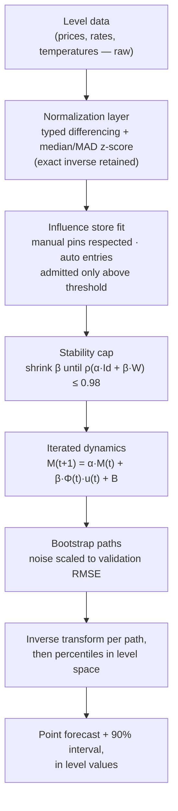

# QNTUM: A Quantified Network of Temporal Unfolding Magnitudes for Interpretable, Editable Multivariate Forecasting

Ayoub Bensakhria  
ayoub.bensakhria@yoctobe.com

---

## Abstract

Most multivariate forecasting systems sit at one of two poles. At one pole, vector autoregressions estimate a dense coefficient matrix that treats every variable as a predictor of every other, whether or not the analyst believes the link exists; at the other, deep sequence models absorb the coupling structure into weights that nobody can read, edit, or defend to a reviewer. Neither pole gives a domain expert the thing they usually have and can rarely use: prior knowledge of *specific* relationships — this rate suppresses that index, with roughly this sign, at roughly this delay — alongside honest ignorance about the rest. In this paper I present QNTUM (QUAntified Network of Temporal Unfolding Magnitudes), a small forecasting model built around a sparse, inspectable influence store. Every relationship in the model is a named entry: a target variable, a tuple of source variables, a weight or a user-supplied formula, and a time lag. Entries the analyst pins by hand are never overwritten; the remaining entries are discovered from data only when they clear a declared correlation threshold, so the fitted structure is a short list a human can read line by line rather than an $n \times n$ block of coefficients. Each variable is additionally wrapped in an *event* with an explicit life cycle — inactive, formation, stable, decay — governed by a piecewise phase function, so that a variable's participation in the dynamics can be switched on, ramped, and retired at declared times. Levels are converted internally to robustly standardized increments (first or log differences, centred by the median and scaled by the median absolute deviation), and multi-step stability is enforced not by clamping data but by capping the spectral radius of the linearized transition matrix below one. I validate the model on five physics systems with known ground truth — harmonic and damped oscillators, the ideal gas law, coupled oscillators, and a pendulum with friction — where it recovers the dynamics with mean held-out correlation between 0.990 and 0.9996 on all five. I then apply the identical pipeline to a small panel of eight US macroeconomic series and report the result honestly: with only sixteen quarterly training increments, the discovered structure has no out-of-sample predictive value (mean one-step correlation −0.19 across seven held-out quarters), and the stability cap is the only reason the eight-quarter forecast remains bounded at all. The contribution is therefore twofold: a forecasting architecture in which every learned coupling is a named, editable, threshold-gated object, and a worked demonstration of exactly how much data that architecture needs before its structure means anything.

**Keywords:** multivariate time series, interpretable forecasting, sparse system identification, influence networks, event dynamics, robust statistics, spectral stability, bootstrap prediction intervals.

---

## 1. Introduction

### 1.1. The problem: coupling structure you cannot read, edit, or bound

A forecaster who works with several interacting series — macroeconomic indicators, sensor channels on one machine, populations in one ecosystem — faces three requirements that existing tools satisfy only one or two at a time.

First, *readability*. The analyst wants to see which variable drives which, with what sign and what delay, in a list short enough to check against domain knowledge. A vector autoregression (VAR) in the tradition of Sims [1] estimates a full $n \times n$ coefficient matrix per lag; with eight variables and two lags that is already 128 numbers, most of them noise dressed as structure, and the standard texts devote whole chapters to the delicate business of deciding which of them to believe [2]. A recurrent or attention-based forecaster does not even produce the 128 numbers; the coupling lives in the weights.

Second, *editability*. Domain experts usually know a handful of relationships with confidence — a policy rate leads inflation with a lag; pressure rises when temperature rises at fixed volume — and know nothing reliable about the rest. There is no clean way to hand a VAR or a neural forecaster three trusted relationships and instruct it to estimate only the remainder without ever touching the three. Bayesian priors shrink coefficients toward a value; they do not *pin* them, and they do not stop a refit from moving them.

Third, *boundedness*. A multi-step forecast produced by iterating a fitted one-step map can explode, and often does exactly when the fit is poorest. The classical stability condition for a VAR — all eigenvalues of the companion matrix inside the unit circle [2] — is a property one checks after estimation, not a constraint one imposes on it. Deep forecasters have no closed-form analogue to check at all.

QNTUM is built to satisfy all three at once, at the deliberate cost of expressive power: it is a small, sparse, mostly-linear model, and I will be explicit in Section 4 about the scale of data below which even that modest structure cannot be identified.

### 1.2. What QNTUM is, in one paragraph

QNTUM (QUAntified Network of Temporal Unfolding Magnitudes — unrelated to quantum mechanics) evolves a scalar *magnitude* per variable in discrete time. Magnitudes influence each other through a sparse relationship store: pairwise entries ($j$ influences $i$ with weight $w$ at lag $\ell$), plus optional higher-order entries where two or three sources jointly influence a target through a product term or a user-supplied formula. Each variable is wrapped in an *event* with an explicit life cycle — inactive, then a linear formation ramp, then stable, then exponential decay — so regime changes are modelled directly rather than absorbed into coefficients. Data enters as robustly standardized increments and leaves as levels via an exact inverse transform. Iterated forecasts are kept bounded by construction: the global influence gain is shrunk until the spectral radius of the linearized transition matrix falls below a declared cap.

### 1.3. Contributions

1. **A named-relationship influence store** (Section 3.4) in which manual entries are never overwritten by fitting, automatic entries must clear a declared significance threshold, and the whole fitted structure is a human-readable list. This is the architectural core.
2. **An explicit event life cycle** (Section 3.2) — a piecewise phase function gating each variable's participation — which makes "this factor was not active yet" and "this factor is winding down" statements of the model rather than residual noise.
3. **A normalization layer with an exact inverse** (Section 3.5): typed differencing (plain or logarithmic per variable) followed by a median/MAD z-score, chosen over the more common percentage-change-plus-squashing pipeline for reasons documented failure by failure.
4. **Stability by construction** (Section 3.6): a spectral-radius cap on the linearized dynamics, enforced by shrinking the influence gain, so that multi-step forecasts decay toward "no further change" rather than exploding — including, as Section 4.2 shows, in exactly the regime where the fitted structure is least trustworthy.
5. **An honest two-phase evaluation** (Section 4): five physics systems with known ground truth on which the model passes cleanly, and one small macroeconomic panel on which it fails held-out validation — reported with the same prominence, because the failure delimits the data regime in which the architecture is usable.

The remainder of the paper is organised as follows. Section 2 places the model against the literatures it borrows from. Section 3 gives the formal objects, with every symbol also stated in plain words. Section 4 reports the evaluation. Section 5 discusses what the results do and do not license, and Section 6 concludes.

---

## 2. Background

QNTUM sits at the intersection of five lines of work, and takes one specific thing from each.

### 2.1. Linear multivariate forecasting

Granger's formalisation of predictive causality [3] and Sims's vector autoregressions [1] established the template QNTUM's pairwise layer follows: variable $j$'s past improving the prediction of variable $i$'s present is the operational meaning of an influence entry, and a lag-one linear map is the workhorse. Lütkepohl's treatment [2] supplies the stability theory — a VAR($p$) is stable if and only if the eigenvalues of its companion matrix lie strictly inside the unit circle — of which Section 3.6's spectral-radius cap is the enforced-by-construction counterpart. What QNTUM changes is the estimation posture: a VAR estimates every entry of the coefficient matrix and leaves pruning to the analyst; QNTUM admits an entry only when it clears a threshold, and stores nothing otherwise. On short samples this is the difference between a model one can read and a matrix of fitted noise.

### 2.2. Sparsity and system identification

The lasso [4] made sparsity an estimation principle: penalise until most coefficients are exactly zero. SINDy [5] carried the idea into dynamical systems, recovering governing equations as sparse combinations of candidate library terms, and demonstrated that oscillators and other low-order physical systems are recoverable from data by sparse regression — precisely the class of systems Section 4.1 uses as ground truth. QNTUM's admission rule (correlation threshold, optional soft-threshold shrinkage band) is a cruder device than either, chosen because its failure mode is legible: a relationship is either in the store with a recorded significance, or absent. The higher-order entries (Section 3.4), in which a *product* of two or three sources predicts a target, are a small step in SINDy's direction — product terms as library functions — without the full library machinery.

### 2.3. Event dynamics

Hawkes processes [6] model events whose occurrence excites the future intensity of other events, with an exponentially decaying kernel. QNTUM borrows the shape but not the stochastic machinery: the phase function of Section 3.2 is a deterministic envelope — ramp, plateau, exponential decay — declaring *when* a variable participates in the coupled dynamics, with the exponential-decay tail playing the same role as the Hawkes kernel's fading memory. The purpose is different: not modelling arrival times, but making regime entry and exit an explicit, inspectable part of a magnitude model.

### 2.4. Deep probabilistic forecasting, and why this model does not compete with it

DeepAR [7] and its successors learn a global autoregressive model across thousands of related series and produce calibrated probabilistic forecasts; on large panels this family is the standard to beat. The M4 competition results [8] carry the complementary message: on many practical series, carefully applied simple statistical methods remain competitive, and hybrid approaches won. QNTUM does not compete on the large-panel axis at all. Its target regime is the small, coupled, expert-annotated system — few variables, some trusted structure, a hard requirement to explain every coupling — where a deep global model has neither the data it needs nor the interpretability the setting demands. Section 4.2 shows that below a certain sample size QNTUM does not have the data it needs either; the difference is that its architecture makes the failure visible as a short list of unconvincing entries rather than as silent overfit.

### 2.5. Robust preprocessing and resampled uncertainty

Two smaller literatures fix two practical failure modes. Leys et al. [9] argue for the median absolute deviation over the standard deviation for outlier-resistant scaling; Section 3.5 adopts median/MAD standardization for exactly the reason they document — a pandemic-scale spike in one quarter should not define the scale of every other quarter. Efron's bootstrap [10] underlies the prediction intervals of Section 3.7, with one ordering rule learned the hard way and stated there: resample paths first, invert to level space per path, and only then take percentiles — inverting a percentile path compounds a worst-case increment at every step and overstates the interval badly.

### 2.6. The gap

**Table 1.** What each neighbouring approach provides, and what QNTUM changes.

| Approach | What it provides | What QNTUM changes |
|---|---|---|
| VAR [1], [2] | Linear lagged coupling, mature stability theory | Sparse admission instead of dense estimation; manual pins never refit; stability enforced, not merely checked |
| Lasso / SINDy [4], [5] | Principled sparsity; recovery of governing equations | A cruder but fully legible admission rule; product terms without a term library |
| Hawkes processes [6] | Excitation with fading memory | A deterministic phase envelope for regime entry/exit, not a point-process likelihood |
| DeepAR / M4 [7], [8] | Accuracy at scale; calibrated intervals | Nothing — different regime; QNTUM targets small expert-annotated systems |
| Robust/bootstrap [9], [10] | Outlier-resistant scale; resampled intervals | Adopted as-is, with the percentile-of-paths ordering made explicit |

---

## 3. Methodology

### 3.1. Overview

The pipeline is: levels in, increments inside, levels out.

Every stage below is stated first formally and then in plain words, because the model is meant to be auditable by people who do not live in the notation.

### 3.2. Events and the phase function

Each variable $i$ is wrapped in an event $E_i$ defined by five numbers.

**Table 2.** Event parameters.

| Symbol | Plain meaning |
|---|---|
| $t_0$ | when the event starts existing |
| $t_f$ | how long it takes to reach full strength (formation) |
| $\tau$ | how long it holds full strength, and the time constant of its fade |
| $B_i$ | a constant drift added at every step (usually 0 for standardized data) |
| $M_i(t_0)$ | the magnitude it starts with |

The **phase function** $\Phi(E_i, t) \in [0, 1]$ is the event's activation level at time $t$:

$$
\Phi(E_i, t) =
\begin{cases}
0 & t < t_0 \quad \text{(inactive)}\\
\dfrac{t - t_0}{t_f} & t_0 \le t < t_0 + t_f \quad \text{(formation, } t_f > 0\text{)}\\
1 & t_0 + t_f \le t < t_0 + t_f + \tau \quad \text{(stable)}\\
e^{-\left(t - (t_0 + t_f + \tau)\right)/\tau} & t \ge t_0 + t_f + \tau \quad \text{(decay)}.
\end{cases}
$$

Two formal notes. If $t_f = 0$ the formation branch is skipped entirely and the event enters the stable state at $t_0$; the ratio is never evaluated at $t_f = 0$. And $\Phi$ is continuous at each boundary: the formation ramp reaches exactly 1 as $t \to t_0 + t_f$, and the decay branch equals $e^0 = 1$ at $t = t_0 + t_f + \tau$.

In plain words: before its start time an event contributes nothing; it then ramps up linearly, holds at full participation for a period $\tau$, and afterwards fades exponentially with the same time constant $\tau$. In the forecasting experiments of Section 4 every variable is given an always-on event ($t_0 = 0$, $t_f = 0$, $\tau$ longer than the horizon), so $\Phi = 1$ throughout and the machinery is inert; it exists for scenario work — injecting a policy shock with a declared onset and lifetime — not for fitting.

### 3.3. Magnitude dynamics

Let $M(t) \in \mathbb{R}^n$ be the vector of magnitudes (standardized increments, Section 3.5). One time step is

$$
M_i(t+1) \;=\; \alpha\, M_i(t) \;+\; \beta\, \Phi(E_i, t)\, u_i(t) \;+\; B_i,
$$

where the three terms are, in order: **memory** — a fraction $\alpha \in [0, 1)$ of the current magnitude persists; **network influence** — the total incoming influence $u_i(t)$ from the relationship store, scaled by a global gain $\beta$ and gated by the event's phase; and **drift** — the constant $B_i$. There is no per-step rescaling and no clamping of $M$; boundedness is the responsibility of the spectral condition in Section 3.6, not of the data path. (An earlier design normalized $M$ by its maximum entry at every step and clamped the result to $[-1, 1]$; it is kept in the codebase as an alternative dynamics mode — v1, documented separately — for exactly the ablation reported in Section 4.4, which is why it was retired from the default path: the clamp hides instabilities the spectral cap now handles honestly.)

The influence sum is taken over every relationship $R$ in the store that targets variable $i$:

$$
u_i(t) \;=\; \sum_{R:\ \mathrm{target}(R) = i} f_R\!\big(M_{j_1}(t - \ell_R),\, \dots,\, M_{j_{k}}(t - \ell_R)\big),
$$

where $j_1, \dots, j_k$ are $R$'s source variables, $\ell_R \ge 0$ is its time lag, and $f_R$ is either a linear product form or a user-supplied formula (next section). Lags are bounded by one time step of the data ($\ell_R \in [0, \Delta t]$), a deliberate restriction: with the short samples this model targets, deeper lag structure is unidentifiable, and the bound keeps the state small. When a requested lag reaches further back than the available history, the oldest recorded state is used.

### 3.4. The influence store

The store replaces the single matrix $I$ of the original design with a sparse map from keys to entries. A key is a pair (target index, tuple of source indices); an entry records the relationship type, its parameters, its significance, its lag, and whether it was set by hand.

**Relationship orders.** An order-2 entry (a *pair*) has one source: $f(x_j) = w\, x_j$. An order-3 entry (a *triplet*) has two sources and, in the linear case, acts through their product: $f(x_j, x_k) = w\, x_j x_k$ — a simple interaction term, nonzero only when both sources move. Order-4 extends this to three sources. Any entry may instead carry an arbitrary formula $f$ supplied by the analyst, which is how exact nonlinear knowledge (Section 4.1's pendulum uses $f(\theta) = -(g/L)\sin\theta \cdot \Delta t$) enters the model without approximation.

**The pinning rule.** An entry set manually is marked and is never modified or removed by any subsequent fit. This is the editability requirement of Section 1.1 made mechanical: the fit routine checks the mark and skips the key. Trusted knowledge and estimated knowledge coexist in one store, distinguishable at a glance.

**Cautious auto-discovery.** For every unpinned candidate pair $(i, j)$ and every candidate lag $\ell$ on a grid over $[0, \Delta t]$, the fit computes the Pearson correlation $r$ between the lagged source $x_j(t - \ell)$ and the target's next value $x_i(t+1)$, over the observations where both are finite (channels with different historical coverage contribute their longest common window). The candidate is admitted only if $|r| \ge r_{\min}$, a threshold the analyst declares; among admitted lags the one with the largest $|r|$ wins. The weight is then the least-squares slope

$$
\hat w \;=\; \frac{\sum_t x_t\, y_t}{\sum_t x_t^2 + \varepsilon},
$$

with $x$ the (lagged) source, $y$ the target's next value, and $\varepsilon = 10^{-8}$ guarding the degenerate denominator. An optional *shrinkage band* softens the hard threshold: candidates with $|r| \in [r_{\min}/2,\, r_{\min})$ enter with their weight scaled linearly down to zero across the band, so a borderline-but-real coupling contributes a small term rather than exactly nothing. Triplet and quadruplet discovery follows the same recipe on product predictors, but only among sources that already passed the pairwise bar, and with hard caps on the number of admitted entries per target — the combinatorics of higher orders is explosive and the caution is deliberate.

Two properties of this procedure should be stated plainly rather than left implicit. Admission is by *correlation*, so an admitted entry is a predictive association, not a causal claim — Granger's caution [3] applies verbatim. And the threshold $r_{\min}$ must be chosen against the sample size: with $T$ observations the standard error of a correlation near zero is roughly $1/\sqrt{T}$, so on sixteen training points (Section 4.2) anything below $|r| \approx 0.5$ is indistinguishable from noise, and the experiment sets $r_{\min} = 0.5$ for exactly that reason.

### 3.5. The normalization layer

The model never operates on level values. Each variable is converted to a stationary increment and standardized, by a transform whose inverse is exact.

**Step 1 — typed differencing.** Per variable, one of two increment types:

| Transform | Formula | Use for |
|---|---|---|
| `diff` (default) | $d_t = x_t - x_{t-1}$ | rates already in percent, series that cross zero, negative levels |
| `log_diff` (opt-in) | $d_t = \ln x_t - \ln x_{t-1}$ | strictly positive multiplicative series (prices, indices) |

Percentage change was rejected as the increment because it is undefined or explosive for zero-crossing series (a GDP growth move from $-0.8$ to $2.4$ is a "$-400\%$ change"), sign-confused for negative levels (a trade balance), and compounds exponentially on reconstruction if the model predicts a persistent value. Differencing has none of these failure modes, and `log_diff` is automatically demoted to `diff`, with a warning, if a series turns out not to be strictly positive.

**Step 2 — robust standardization.**

$$
z_t \;=\; \frac{d_t - m}{1.4826 \cdot \mathrm{MAD}}, \qquad
m = \mathrm{median}(d), \quad \mathrm{MAD} = \mathrm{median}\big(|d - m|\big),
$$

where the constant $1.4826 \approx 1/\Phi^{-1}(3/4)$ makes the MAD a consistent estimate of the standard deviation under Gaussian data while remaining insensitive to outliers [9]. The result reads naturally: $z = 0$ is the typical (median) change for that variable, $z = +1$ is one robust standard deviation above typical. The output is *not* squashed into $[-1, 1]$: an earlier design applied $\tanh$ here, and its inverse ($\mathrm{arctanh}$) amplified enormously near saturation, blowing up reconstructed forecasts. Boundedness was moved out of the data path and into the dynamics (next section), where it can be guaranteed rather than faked.

**Exact inverse.** Forecast increments map back to levels by de-standardizing ($d = z \cdot 1.4826\,\mathrm{MAD} + m$) and then cumulatively summing (`diff`) or exponentiating the cumulative sum (`log_diff`) from the last observed level. Note that the median $m$ is added back at every step, so a forecast of "no further signal" ($z = 0$) reproduces the variable's typical historical drift, not a frozen level.

### 3.6. Stability by construction

Collect the pairwise weights into a matrix $W \in \mathbb{R}^{n \times n}$, $W_{ij} = w$ for each admitted pair $(i \leftarrow j)$. Ignoring phase gating ($\Phi = 1$), drift, lags, and higher-order terms, the dynamics of Section 3.3 linearize to

$$
M(t+1) \;=\; A\, M(t), \qquad A = \alpha\, \mathrm{Id} + \beta\, W,
$$

and the iterated map converges to zero from every initial state if and only if the spectral radius $\rho(A) = \max_k |\lambda_k(A)|$ — the largest absolute eigenvalue — is below one. This is the enforced counterpart of the VAR stability condition [2]. The builder computes $\rho(A)$ after fitting and, if it exceeds a declared cap ($\rho_{\max} = 0.98$), shrinks the global gain $\beta$ by 10% repeatedly until the cap is met; since $\beta \to 0$ gives $\rho = \alpha < \rho_{\max}$, termination is guaranteed. The consequence for forecasts is direct: in increment space the noise-free trajectory decays geometrically toward zero, so in level space the forecast flattens toward "no further change beyond typical drift" instead of exploding — a conservative long-horizon behaviour that is exactly what one wants from a model that knows its coupling estimates are uncertain.

The honest caveat: the guarantee covers the *linearized, lag-free, pairwise* dynamics. Lagged entries would enter a full analysis through a companion matrix, and higher-order product terms are not linear at all; the cap as implemented folds all pairwise weights into one $W$ regardless of lag and ignores orders above two. For the configurations evaluated in Section 4 (lags of at most one step, higher orders either absent or exactly pinned) the gap between the guarantee and the truth is small, but it is a gap, and it is listed again in Section 5.3.

### 3.7. Uncertainty

Prediction intervals come from a parametric bootstrap [10]. The model is rolled forward $n_{\mathrm{boot}}$ times (300 in Section 4.2) from the same initial state; at each step of each path, Gaussian noise with standard deviation $\sigma \cdot (1 + 0.03k)$ is added at horizon step $k$, where $\sigma$ is set to the model's *own one-step validation RMSE* — so the intervals reflect measured error, not an assumed noise level. Each complete path is then inverse-transformed to level space, and the 5th and 95th percentiles are taken across paths, per variable, per horizon. The ordering matters and was learned by getting it wrong: taking percentiles in increment space and inverse-transforming the two percentile *paths* compounds a worst-case increment at every step of the cumulative sum, producing intervals far wider than the paths themselves ever are. Percentiles of inverted paths, never inversion of percentile paths.

### 3.8. What is estimated, and what is declared

**Table 3.** Estimated versus declared components.

| Component | Status | How it is set |
|---|---|---|
| Pinned relationships | Declared | By the analyst; never touched by fitting |
| Auto relationships (weight, lag, significance) | Estimated | Threshold-gated correlation + least-squares slope (§3.4) |
| Memory $\alpha$ | Declared | Fixed at 0.85 in all experiments |
| Gain $\beta$ | Declared, then capped | Starts at 0.50; shrunk only by the stability cap (§3.6) |
| Normalization centre/scale | Estimated | Median and MAD of training increments (§3.5) |
| Phase parameters $t_0, t_f, \tau$ | Declared | By the analyst; always-on in the experiments here |
| Interval noise scale $\sigma$ | Estimated | One-step validation RMSE (§3.7) |

Notably, $\alpha$ and $\beta$ are not tuned per dataset: the same $(\alpha, \beta) = (0.85, 0.50)$ pair runs both the physics suite and the macro panel, with the cap alone adjusting $\beta$ where the fitted structure demands it. This is a deliberate choice — a model this small, tuned per dataset, would owe most of its reported accuracy to the tuning.

---

## 4. Evaluation

Validation is one-step-ahead and rolling: the store is fitted on the training segment only; on the held-out segment, the model predicts each next observation from the actual current one, and I report the mean absolute error (MAE), root mean squared error (RMSE), and per-variable Pearson correlation between predicted and actual increments. All figures below are from runs of the code in this repository, reproducible with `python main_v2.py`.

### 4.1. Physics systems with known ground truth

Before touching data whose true structure nobody knows, the model must earn its keep on systems whose structure is exactly known. Five synthetic systems of increasing complexity are generated from their governing equations; for each, the true relationships are pinned into the store (including one genuinely nonlinear pin — the pendulum's $-(g/L)\sin\theta$ term — supplied as a formula), auto-discovery runs on top with $r_{\min} = 0.10$, and validation uses a 50/50 train/test split. The pass bar is mean held-out correlation above 0.90.

**Table 4.** Physics validation suite. All metrics on held-out data, in standardized increment space.

| System | Variables | Mean corr. | MAE | Worst variable | Result |
|---|---|---|---|---|---|
| Simple harmonic oscillator ($\ddot x = -\omega^2 x$) | $x, v$ | 0.9994 | 0.047 | $v$: $r = 0.9989$ | pass |
| Damped oscillator ($\ddot x = -\omega^2 x - \gamma \dot x$) | $x, v$ | 0.9996 | 0.071 | $v$: $r = 0.9992$ | pass |
| Ideal gas law ($PV = nRT$) | $P, V, T$ | 0.9900 | 0.101 | $V$: $r = 0.9832$ | pass |
| Coupled oscillators (two masses, coupling spring) | $x_1, v_1, x_2, v_2$ | 0.9969 | 0.088 | $x_2$: $r = 0.9941$ | pass |
| Pendulum with friction ($\ddot\theta = -\tfrac{g}{L}\sin\theta - b\dot\theta$) | $\theta, \omega$ | 0.9989 | 0.068 | $\theta$: $r = 0.9984$ | pass |

Five of five pass, with the weakest single variable at $r = 0.983$. Two readings of this table are warranted and one is not. Warranted: the update equation, the store, the normalization and the validation harness are correct end to end — an error in any of them would not survive contact with a harmonic oscillator; and a nonlinear pinned formula coexists with linear auto-discovered entries in one store without special-casing. Not warranted: any claim about performance on systems whose structure is unknown, because here the structure was handed to the model. These systems are of exactly the class sparse identification methods recover routinely [5]; passing is the entry ticket, not the result.

### 4.2. A small macroeconomic panel: an honest failure

The identical pipeline — same $\alpha$, same $\beta$, same code path — is then applied to a panel of eight US series (CPI inflation, federal funds rate, unemployment, GDP growth, 10-year yield, trade balance, dollar index, S&P 500) observed quarterly from 2020 Q1 to 2025 Q4: 24 rows of levels, hence 23 increments, split 16 training / 7 held-out. The equity index and dollar index use `log_diff`; everything else, including the zero-crossing GDP growth and the negative-valued trade balance, uses plain `diff`. No relationship is pinned; discovery runs with $r_{\min} = 0.50$, the threshold Section 3.4's $1/\sqrt{T}$ argument demands at $T = 16$.

The fit admits 19 pairwise entries, several of them economically plausible on their face (unemployment moving with GDP growth at $r = 0.96$ is Okun's law wearing a costume; CPI responding negatively to the lagged funds rate at $r = 0.74$ has the textbook sign). Then two things happen that constitute the real content of this experiment.

First, the stability cap fires, hard: the admitted structure gives $\rho(\alpha\,\mathrm{Id} + \beta W) = 1.429$, explosive dynamics, and the builder shrinks $\beta$ from 0.500 to 0.103 to bring $\rho$ to 0.969. Nineteen weights fitted on sixteen points produce a transition matrix that would diverge within a few steps if iterated as fitted. The cap is not a formality; on this panel it is the difference between a forecast and an overflow.

Second, held-out validation returns the verdict.

**Table 5.** One-step-ahead validation on 7 held-out quarters (6 usable prediction steps), standardized increment space. MAE 0.872, RMSE 1.218.

| Variable | Held-out $r$ | Variable | Held-out $r$ |
|---|---|---|---|
| CPI | $+0.14$ | 10Y yield | $-0.30$ |
| Fed funds rate | $+0.11$ | Trade balance | $-0.61$ |
| Unemployment | $+0.05$ | Dollar index | $-0.35$ |
| GDP growth | $-0.44$ | S&P 500 | $-0.09$ |

Mean correlation: $-0.19$. The discovered structure has no out-of-sample predictive value on this sample; several correlations are *negative*, meaning the admitted relationships, fitted on sixteen points and evaluated on six, point the wrong way as often as the right one. An MAE of 0.87 in a space where the typical change is 1.0 by construction says the model is barely better than predicting "typical change" every time — and the correlations say the structure is why.

I report this as the central negative result rather than tuning it away, because every obvious rescue is a way of hiding it. Lowering $r_{\min}$ admits more noise. Raising it toward 1 empties the store and leaves a pure decay model. Tuning $\alpha, \beta$ per-dataset launders test information into the fit. The honest statement is that sixteen quarterly observations cannot identify a 19-edge influence structure over eight variables, no matter how the admission rule is dressed — the same arithmetic that warns against dense VARs on short samples [2] applies undiminished to sparse stores. What survives the failure is the *behavioural* claim: the capped model still produces a bounded, smooth, interval-wrapped 8-quarter forecast (point paths decaying toward typical drift, 90% intervals from 300 bootstrap paths widening with horizon), which is precisely the conservative degradation Section 3.6 was built to guarantee when the structure is weak.

### 4.3. Ablation: per-step clamp vs. spectral cap

Section 3.3 mentions in passing that an earlier design bounded $M$ by rescaling it to its own maximum entry and clamping to $[-1, 1]$ at every step, and that this was replaced by the spectral-radius cap of Section 3.6. The two mechanisms are similar enough in spirit — both exist purely to stop a multi-step forecast from exploding — that it is worth showing they are not interchangeable, rather than asserting it. Both are retained in the codebase (v1: relative-scale coupling with a per-step clamp, matching the original design note; v2: the spectral cap of Section 3.6) behind a single switch, so the comparison uses the identical fitted store from Section 4.2 — same 19 admitted entries, same $\alpha = 0.85$, same declared $\beta = 0.50$ — and differs only in how each mode keeps the iterated forecast bounded.

**v2 (spectral cap).** As reported in Section 4.2, $\rho(\alpha\,\mathrm{Id} + \beta W) = 1.429$ at the declared $\beta$, so the builder shrinks $\beta$ once, globally, before simulating: $\beta_{v2} = 0.103$, bringing $\rho$ to 0.969. The shrink happens a single time, at fit time; every step of the forecast then uses the same, now-contractive, linear map.

**v1 (per-step clamp).** $\beta$ keeps its full declared value, $\beta_{v1} = 0.50$ — nothing is shrunk at fit time. Instead, at every step the history fed to the influence sum is rescaled by its own running maximum (Section 2, "linear dynamics mode" vs. "default mode" in `documentation/QNTUM-model.md`), and the resulting magnitude is clamped to a declared bound (4.0 in standardized-increment units here).

Both modes are handed the same explosive structure ($\rho = 1.429$, uncapped) and neither is allowed to move $\beta$ mid-run. Table 6 tracks $\max_i |M_i(t)|$ — the largest standardized magnitude across all eight variables — at each of the eight forecast steps that follow the 16-quarter fit.

**Table 6.** Per-step maximum magnitude, v1 (clamp) vs. v2 (spectral cap), same fitted store as Section 4.2.

| Step | 1 | 2 | 3 | 4 | 5 | 6 | 7 | 8 |
|---|---|---|---|---|---|---|---|---|
| v1, $\max_i \lvert M_i(t)\rvert$ | 0.983 | 0.835 | 0.710 | 0.868 | 1.332 | 2.231 | 3.072 | 3.499 |
| v2, $\max_i \lvert M_i(t)\rvert$ | 0.983 | 0.835 | 0.710 | 0.604 | 0.513 | 0.436 | 0.371 | 0.315 |

The two trajectories are identical for three steps, then diverge in kind, not just in degree. v2 decays geometrically from step 3 onward, as Section 3.6 guarantees it must: the shrunk $\beta$ makes the linear map contractive, so every subsequent step is smaller than the last, with a stable decay ratio (0.83 per step, matching $\rho = 0.969$ to within the nonlinearity the phase gating and lag structure introduce). v1 decays for exactly as long as the row-normalization happens to suppress the still-explosive underlying structure, then grows again — by step 8 the trajectory has more than quadrupled from its low point and is closing on the declared clamp of 4.0. Run one step further and it hits the clamp outright, at which point the model's output is determined by the clamp bound, not by the fitted store at all.

This is the difference between bounding a symptom and treating its cause. The clamp is a correct statement about the state at the instant it fires — $\lvert M_i(t)\rvert$ never exceeds 4.0, in this run or any other — but it is not a statement about the trajectory's tendency, because the operator generating that trajectory ($\alpha\,\mathrm{Id} + \beta W$ at the *undiminished* $\beta = 0.50$) still has $\rho = 1.429 > 1$ throughout the run; the clamp merely intervenes after the fact, every time growth threatens to leave the box, and says nothing about whether growth will threaten again next step (here, it does, immediately). The spectral cap changes the operator itself, once, so that no per-step intervention is needed at all: $\rho < 1$ is not a box the trajectory is kept inside of, it is a property that makes the trajectory shrink on its own.

Two caveats keep this from being a blanket recommendation. First, v1's guarantee is unconditional and structure-independent — $\lvert M_i(t)\rvert \le 4.0$ holds regardless of what $\rho$ turns out to be, whereas v2's guarantee is conditional on the linearization of Section 3.6 (lag-free, pairwise-only) actually describing the fitted dynamics; where that linearization is a poor approximation, v2's certificate is weaker than it looks and v1's crude bound, being agnostic to structure, is not. Second, on every well-conditioned fit in this paper — the full physics suite of Section 4.1, and the macro panel of Section 4.2 evaluated on its full 24-quarter sample rather than the 16-quarter stress split above — $\rho$ never approaches the cap, both modes coincide exactly, and the ablation is silent: the difference in Table 6 is a property of what happens when the fitted structure is genuinely unstable, which is precisely the small-sample regime Section 4.2 is built to expose. v2 is the default for the reason Table 6 gives: a guarantee about the trajectory's tendency is more useful than a guarantee about its instantaneous magnitude, when the two are available for comparable cost. But the comparison is only informative because both mechanisms were pushed into the regime where they disagree, rather than tuned to agree.

### 4.4. What the evaluation licenses

- **Licensed:** correctness of the pipeline end to end (Table 4); coexistence of pinned nonlinear knowledge and thresholded discovery in one store; the stability cap doing real work under a badly overfitted structure (Section 4.2); the qualitative difference between bounding a trajectory's instantaneous magnitude and bounding its tendency, demonstrated rather than asserted (Section 4.3); interval construction that reflects measured one-step error.
- **Not licensed:** any forecasting-accuracy claim on real economic data; any causal reading of discovered entries; any claim that the higher-order (triplet/quadruplet) discovery adds value, since it was disabled on the macro panel and exactly pinned in the physics suite. The minimum sample at which discovered structure becomes predictive on real data is an open empirical question this paper poses and does not answer.

---

## 5. Discussion

### 5.1. What the architecture buys

The store is the point. After the macro fit, the entire learned model is nineteen printed lines, each naming a target, a source, a signed weight, a lag, and the correlation that admitted it. An economist can read that list in a minute, recognise Okun's law, raise an eyebrow at "unemployment ← trade balance, $w = 2.63$", and delete the eyebrow-raiser without touching anything else — pinned entries and remaining auto entries are unaffected, and the stability cap re-evaluates on the next build. No VAR coefficient block and no weight tensor supports that interaction. The same property makes the model's failures legible: Table 5 does not say "the model underperforms"; it says *which* couplings failed to generalise, by name.

The second purchase is behavioural: a declared worst case. Because $\rho < 1$ is enforced rather than hoped for, the model's response to unidentifiable structure is to shrink toward a drift forecast with honest intervals — visibly humble output rather than confidently divergent output. Section 4.2 is a live demonstration under conditions (overfitted store, tiny sample) that are the realistic operating regime for the small expert systems this model targets.

### 5.2. Where the model fits

The physics suite and the macro panel bracket the operating envelope from both sides. Systems that are genuinely low-order, densely sampled relative to their dynamics, and partially known to the analyst — instrumented machines, controlled processes, laboratory systems, and scenario studies where the analyst *supplies* the couplings and wants disciplined propagation with uncertainty — sit inside it. Short-history observational panels with unknown structure sit outside it, and Section 4.2 measures how far outside. In between lies the intended use that neither experiment fully exercises: a store seeded with several trusted, pinned relationships plus discovery over the remainder, where the pins carry the identification burden the data cannot.

### 5.3. Limitations

- The stability guarantee covers the linearized, lag-free, pairwise dynamics only; lagged entries belong in a companion-matrix analysis and higher-order product terms escape the linearization entirely (Section 3.6). A fitted-structure certificate covering both is future work, not a formality.
- Admission is by marginal correlation, one candidate at a time. Correlated sources can each clear the threshold by proxying for the other, inflating the store; no joint selection (of the lasso type [4]) is performed.
- The lag search is bounded at one time step of the data. Genuine multi-period lead–lag structure — common in macroeconomics — is invisible to the model by construction.
- Bootstrap noise is Gaussian, independent across variables and steps; cross-sectional error correlation, which certainly exists in Section 4.2's panel, is ignored, and the intervals inherit that omission.
- The macro experiment establishes a lower bound on required data, not an upper one; no experiment here locates the sample size at which discovery starts to generalise.
- The phase machinery ($t_0, t_f, \tau$) is exercised nowhere in the evaluation — every event is always-on. Its value for scenario injection is a design argument, not a demonstrated result.

---

## 6. Conclusion and Future Work

This paper presented QNTUM, a small multivariate forecasting model whose learned content is a sparse list of named relationships — pinned entries never refit, discovered entries admitted only above a declared significance bar — wrapped in an explicit event life cycle, driven on robustly standardized increments with an exact inverse, and kept bounded by an enforced spectral-radius cap rather than by data clamping. On five physics systems with known ground truth the pipeline recovers the dynamics essentially perfectly (mean held-out correlation 0.990–0.9996, five of five passing). On a 24-quarter macroeconomic panel it fails held-out validation (mean one-step correlation $-0.19$), and the paper reports that failure as its second result: sixteen training increments cannot identify nineteen couplings, the stability cap is what keeps even the failed model's forecasts bounded, and the architecture's contribution in that regime is that the failure arrives itemised and legible instead of hidden inside a coefficient block.

Future work, in the order the model actually needs it:

1. Locate the sample-size threshold at which discovered structure generalises, by subsampling long panels where truth is approximately known.
2. Run the intended hybrid regime — several pinned, expert-supplied macro relationships plus discovery over the remainder — and measure whether pins rescue the small-sample case.
3. Extend the stability certificate to the fitted structure as it actually is: companion-matrix analysis for lagged entries, and a bound (or an explicit disclaimer) for higher-order terms.
4. Replace one-at-a-time correlation admission with a joint sparse selection step, keeping the store's named-entry format as the output.
5. Exercise the phase machinery on a real scenario task — a declared shock with onset, plateau, and decay — which is what it was designed for and where none of the systems evaluated here needed it.

The design commitment throughout is that a forecasting model used by people who must defend its output should consist of objects those people can read, veto, and bound — and that when the data cannot support such objects, the model should say so in its structure rather than in its residuals.

---

## References

[1] C. A. Sims, "Macroeconomics and reality," *Econometrica*, vol. 48, no. 1, pp. 1–48, Jan. 1980, doi: 10.2307/1912017.

[2] H. Lütkepohl, *New Introduction to Multiple Time Series Analysis*. Berlin, Germany: Springer, 2005.

[3] C. W. J. Granger, "Investigating causal relations by econometric models and cross-spectral methods," *Econometrica*, vol. 37, no. 3, pp. 424–438, Aug. 1969, doi: 10.2307/1912791.

[4] R. Tibshirani, "Regression shrinkage and selection via the lasso," *J. Roy. Statist. Soc. Ser. B*, vol. 58, no. 1, pp. 267–288, 1996, doi: 10.1111/j.2517-6161.1996.tb02080.x.

[5] S. L. Brunton, J. L. Proctor, and J. N. Kutz, "Discovering governing equations from data by sparse identification of nonlinear dynamical systems," *Proc. Natl. Acad. Sci. U.S.A.*, vol. 113, no. 15, pp. 3932–3937, Apr. 2016, doi: 10.1073/pnas.1517384113.

[6] A. G. Hawkes, "Spectra of some self-exciting and mutually exciting point processes," *Biometrika*, vol. 58, no. 1, pp. 83–90, Apr. 1971, doi: 10.1093/biomet/58.1.83.

[7] D. Salinas, V. Flunkert, J. Gasthaus, and T. Januschowski, "DeepAR: Probabilistic forecasting with autoregressive recurrent networks," *Int. J. Forecasting*, vol. 36, no. 3, pp. 1181–1191, 2020, doi: 10.1016/j.ijforecast.2019.07.001.

[8] S. Makridakis, E. Spiliotis, and V. Assimakopoulos, "The M4 competition: 100,000 time series and 61 forecasting methods," *Int. J. Forecasting*, vol. 36, no. 1, pp. 54–74, 2020, doi: 10.1016/j.ijforecast.2019.04.014.

[9] C. Leys, C. Ley, O. Klein, P. Bernard, and L. Licata, "Detecting outliers: Do not use standard deviation around the mean, use absolute deviation around the median," *J. Exp. Soc. Psychol.*, vol. 49, no. 4, pp. 764–766, Jul. 2013, doi: 10.1016/j.jesp.2013.03.013.

[10] B. Efron, "Bootstrap methods: Another look at the jackknife," *Ann. Statist.*, vol. 7, no. 1, pp. 1–26, Jan. 1979, doi: 10.1214/aos/1176344552.
