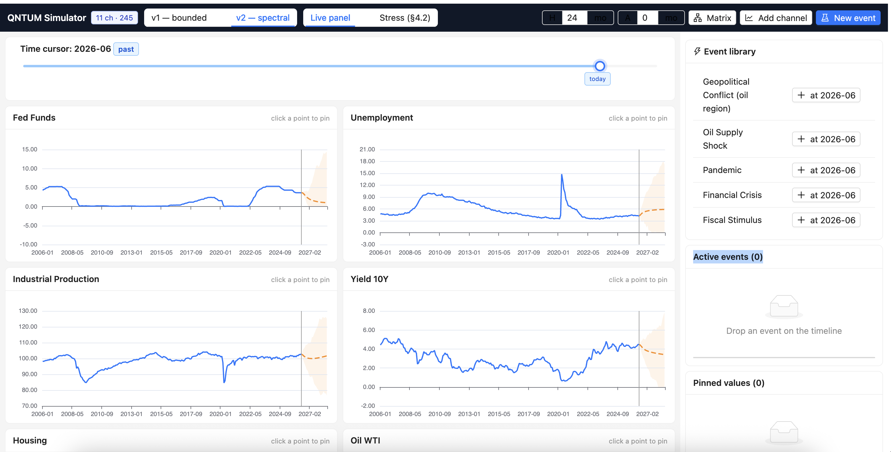
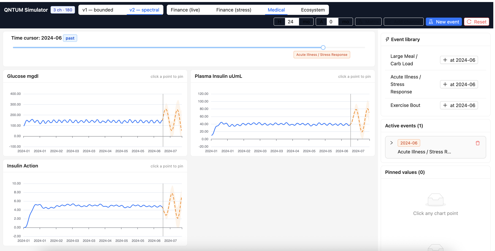
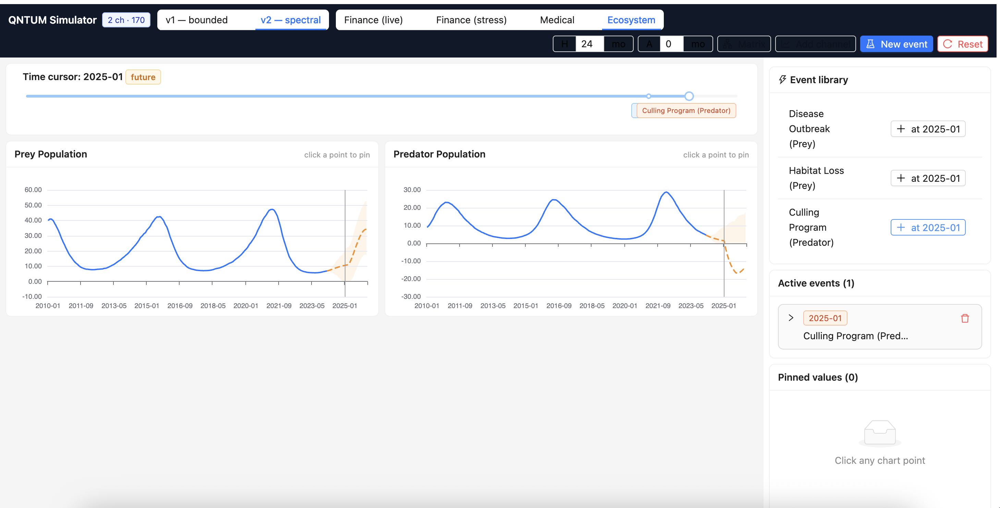
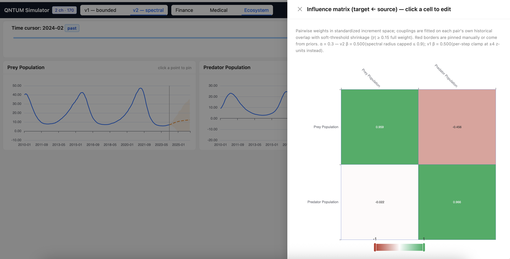
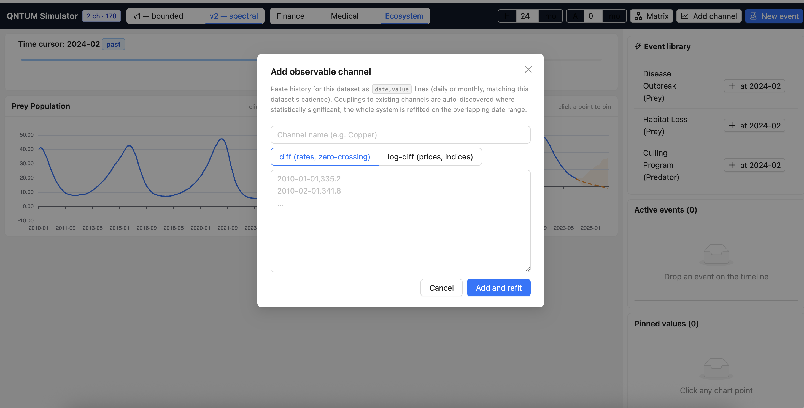

# QNTUM

**QUAntified Network of Temporal Unfolding Magnitudes**

An interpretable, editable multivariate forecasting model for small coupled systems: named relationships you can pin and audit, event timing you can declare, and lag-aware stability built into the store you actually run.

**Paper:** [QNTUM: A Quantified Network of Temporal Unfolding Magnitudes for Interpretable, Editable Multivariate Forecasting](https://www.researchgate.net/publication/413753331_QNTUM_A_Quantified_Network_of_Temporal_Unfolding_Magnitudes_for_Interpretable_Editable_Multivariate_Forecasting)  
**Code:** [github.com/yoctobe/qntum](https://github.com/yoctobe/qntum/)



---

## Why this exists

A forecaster often knows a few couplings with certainty and little about the rest. Three needs follow:

1. **Readable** — which variable affects which target, with what sign and lag  
2. **Editable** — trusted edges stay fixed; impossible edges stay out  
3. **Bounded** — stability is checked on the lagged transition the model actually executes

Restricted and sparse VAR methods can constrain coefficients. QNTUM keeps those ideas but exposes every nonzero term as a **named influence entry** with constraint state, scenario timing, and stability metadata — one store for inspection, editing, and simulation.

It is built for *small coupled systems* where individual relationships must stay auditable (instrumented processes, lab systems, sensor networks, scenario analysis). It is **not** competing with deep global forecasters on panel-scale accuracy alone.

---

## What QNTUM is

Two inputs drive the simulation:

1. **Influence store** — named relationships (target, sources, lag, coefficient or formula, constraint state)  
2. **Initial magnitudes** at $t_0$, with optional event envelopes

Levels go in raw (prices, rates, GDP, temperatures). Internally each series becomes a stationary increment (diff or log-diff), then a robust z-score (median / MAD) fitted on **training observations only**. You do not pre-normalize.

Magnitudes update as memory (optional) plus a phase-gated network sum:

$$
M_i(t+1) = b_i + \alpha\, M_i(t) + \beta\, \Phi_i(t)\, u_i(t) + B_i
$$

where $u_i(t)$ is the sum of stored relationships targeting $i$. Experiments typically set $\alpha = 0$ and estimate persistence through named self-edges; $\beta$ may shrink so the companion-matrix spectral radius stays below one.

| Term | Role |
|------|------|
| $\alpha \cdot M_i(t)$ | Memory — persistence of own magnitude |
| $\beta \cdot \Phi_i \cdot u_i$ | Network influence — gated by event phase |
| $b_i$, $B_i$ | Intercept / declared drift |

Full theory: [`documentation/QNTUM-model.md`](documentation/QNTUM-model.md) · paper draft: [`QUNTUM_draft.md`](QUNTUM_draft.md)

---

## Events and phase $\Phi$

Each factor can carry an event envelope: start $t_0$, formation $t_f$, and decay $\tau$:

**Inactive → Formation → Stable → Decay**

$$
\Phi_i(t) =
\begin{cases}
0 & t < t_0 \\
(t - t_0)/t_f & \text{formation} \\
1 & \text{stable} \\
e^{-(t - (t_0 + t_f + \tau))/\tau} & \text{decay}
\end{cases}
$$

When $\Phi = 0$, incoming influence is off. Timing is **declared** (scenario design), not discovered from data.

---

## Influence store

Each entry is a relationship object:

$$
R = (i,\, J,\, \ell,\, g,\, w,\, q,\, c)
$$

target, sources, lag, feature, coefficient, admission score, constraint state.

- **Pin** fixed, sign-constrained, bounded, or forbidden edges — never overwritten by fitting  
- Free entries are selected and estimated **jointly** (sparse L1 fit), not one marginal coefficient per candidate  
- Expandable when new channels / events are added

Linear lagged dynamics assemble into a **companion matrix**; global gain is reduced until $\rho(A_c) \leq 0.98$. Forecast intervals use chronological conformal calibration on a segment held out from the final test period.

---

## What the paper shows

In **1,800** controlled sparse five-variable fits, correct pins improved structure recovery without buying a general forecast win:

| Observations | Pin coverage | Support F1 | Six-step MAE |
|---:|---:|---:|---:|
| 80 | 0% → 50% | 0.711 → **0.786** | ~0.183 (Δ < 1%) |
| 320 | 0% → 50% | 0.817 → **0.905** | ~0.183 (Δ < 1%) |

On two UCI panels (Air Quality, Appliances Energy), QNTUM stayed in the same ballpark as zero-increment and VAR baselines. A US macro contrast remains a negative control where simple baselines win — a reminder of the operating range.

**Takeaway:** the demonstrated benefit is **structural recovery under correct partial knowledge**, not universal forecasting superiority. Wrong pins hurt coefficient quality; the companion-matrix cap stops sustained explosive growth in near-boundary ablations.

Reproduce paper artifacts:

```bash
cd Model
python3 -m pytest tests test_simulator.py -q
python3 -m experiments.run_all --full
python3 -m experiments.check_publication_gates
```

---

## Simulator

Interactive UI (`simulator/`) on the same engine:

- Timeline cursor over past → present → future  
- **Pin** any chart point — other channels react through $I$  
- **Event library** — shocks with formation / intensity / decay  
- Editable influence matrix heatmap  

| Dataset | Domain | What it shows |
|---------|--------|---------------|
| Finance | US macro panel, monthly, 2006→present | Well-conditioned fit |
| Medical | Synthetic glucose/insulin | Discovery recovers physiology (insulin ↓ glucose) |
| Ecosystem | Synthetic predator/prey | Same engine, ecological couplings |






### Run

```bash
# Backend
cd simulator/backend
pip install -r requirements.txt
uvicorn app:app --port 8000

# Frontend (separate terminal)
cd simulator/frontend
npm install
npm run dev   # → http://localhost:5173
```

Refresh macro data: `python3 simulator/backend/fetch_data.py`  
Regenerate medical/ecosystem panels: `python3 Model/generate_example_domains.py`

---

## When to use it / when not to

**Fits well:** small systems with a few defendable couplings; need for audit, scenario timing, and editable structure.

**Does not fit:** no stable relationship store to justify; long unknown lags; accuracy-only leaderboards; claims of causality from discovered edges alone.

---

## Repo layout

| Path | Contents |
|------|----------|
| `documentation/QNTUM-model.md` | Original model specification |
| `QUNTUM_draft.md` | Paper draft |
| `Model/quantum_model/` | Core library (influence store, dynamics, evaluation) |
| `Model/experiments/` | Reproducible tables / publication gates |
| `simulator/` | FastAPI + React app |

---

## Citation

If you use QNTUM, please cite the paper:

> A. Bensakhria, “QNTUM: A Quantified Network of Temporal Unfolding Magnitudes for Interpretable, Editable Multivariate Forecasting,” 2026.  
> https://www.researchgate.net/publication/413753331_QNTUM_A_Quantified_Network_of_Temporal_Unfolding_Magnitudes_for_Interpretable_Editable_Multivariate_Forecasting

---

## License / author

Ayoub Bensakhria · Yoctobe Ltd · Liverpool, UK · ayoub.bensakhria@yoctobe.com
