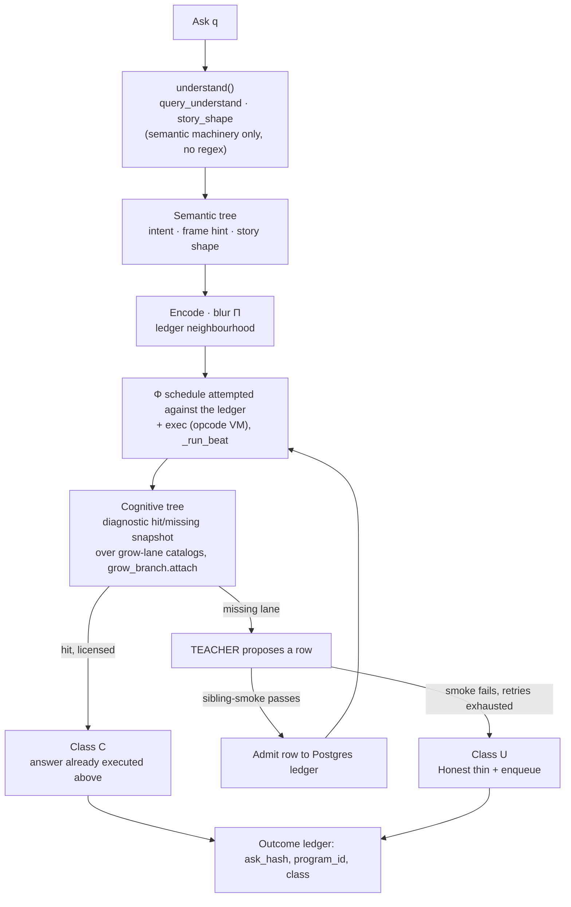
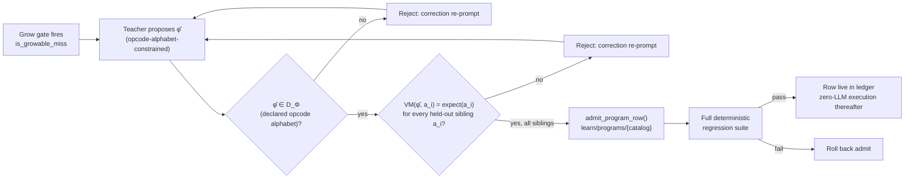
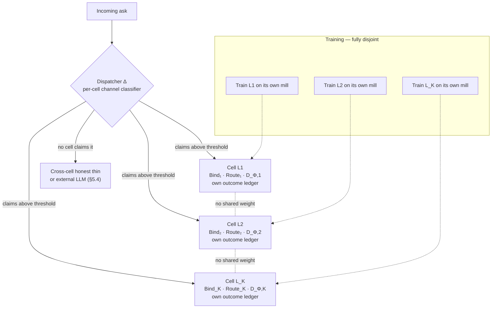
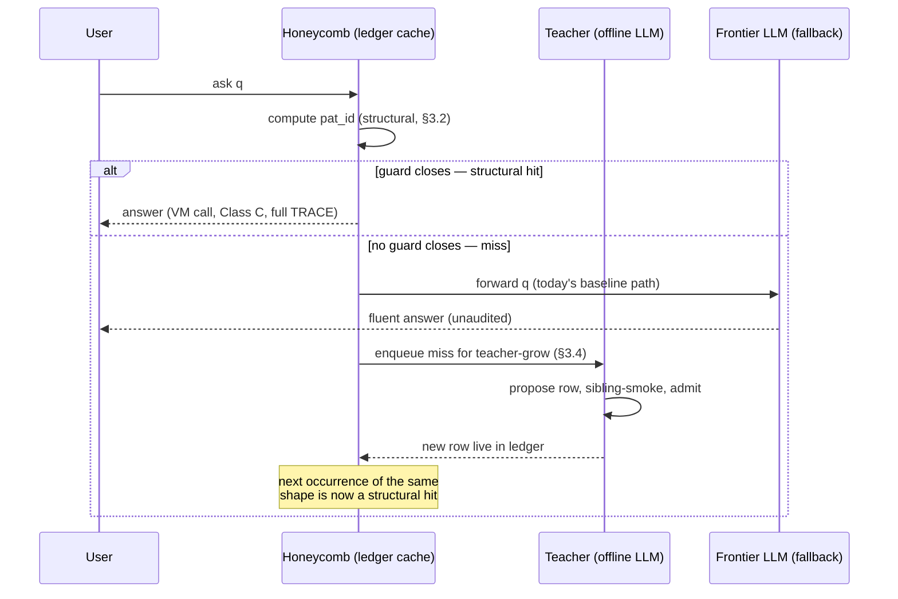

# NSLM: A Neuro-Symbolic Ledger Machine for Auditable Reasoning without a Language Model on the Answer Path

Ayoub Bensakhria

---

## Abstract

Large language models fold understanding, reasoning, knowledge retrieval and generation into a single opaque forward pass. Their accuracy on a task and their ability to explain *why* a given output was produced are two independent, uncorrelated properties of that same pass — there is no architectural seam at which an audit trail can be inserted. Current approaches to making this pass more reliable (chain-of-thought prompting, tool use, skill libraries, post-hoc confidence calibration, reasoning fine-tuning) all leave the language model on the live answer path, and a growing body of evidence shows that the model's own confidence is nearly powerless to separate a correct answer from a fluent wrong one. In this paper I propose NSLM, a Neuro-Symbolic Ledger Machine that starts from the opposite premise: factor the pipeline at the seam between *which capability fires* and *what that capability computes*, and make every fired capability a named, versioned, replaceable row in a database rather than a weight pattern smeared across billions of parameters. Bind and Route are small, cheaply-trained classifiers; Execute is a deterministic opcode virtual machine reading a program row from a Postgres-backed ledger. The only place a language model is permitted to run is offline, as a teacher proposing new rows, which are admitted only after a deterministic sibling-smoke gate. Once a shape is known, every subsequent ask of that shape executes with zero language-model calls, deterministic latency, and a byte-identical audit trail. I evaluate the architecture on a sealed contest-style mathematics question and five unseen structural siblings: one admitted pack, a router trained in twelve seconds on CPU, licensed numbered-step derivations in ~1 ms, every intermediate independently brute-force verified. Comparison against frontier language models on the same sealed set is left for a forthcoming benchmark and is not claimed here. Because a domain ledger carries no shared weights or gradients with any other domain ledger, mastering many nano-domains in parallel is an embarrassingly parallel operation across cheap machines rather than a single coordinated large-cluster training run — a "honeycomb" of independently trained, independently portable knowledge cells, each exportable and composable without retraining or catastrophic forgetting. I discuss where this property is most valuable for enterprise deployment — regulated numeric, financial, clinical, legal and compliance workflows in which a frontier LLM's fluent-but-unaudited answer is itself the liability — and I examine, and partly qualify, the proposal that a structural ledger of this kind can act as a licensing-aware cache in front of a frontier LLM, absorbing repeated-shape traffic only where its admission cost is justified by traffic volume and by the cost of a silently wrong cached answer. The contribution of this paper is architectural: on the axis the field is still trying to approximate from outside a black box — knowing when an answer is licensed, wrong, or genuinely unknown — NSLM has that property by construction.

**Keywords:** neuro-symbolic AI, program synthesis, auditable reasoning, abstention, large language models, virtual machines, knowledge ledgers, selective prediction, federated and parallel training, semantic caching, enterprise AI governance.

---

## 1. Introduction

### 1.1. Opaque generation and the missing audit seam

In recent years, large language models (LLMs) have become the default substrate for question answering, mathematical derivation, code synthesis and document comprehension [1]–[7]. A single monolithic sequence model $p_\theta(y \mid x)$ is trained end-to-end so that understanding, reasoning, knowledge retrieval and generation all happen inside one forward pass, over one shared parameter tensor $\theta \in \mathbb{R}^N$, with $N$ in the billions. The scaling-law literature has shown, with considerable regularity, that more tokens and more parameters lower cross-entropy and improve sample quality [3]–[5]. What it has not shown is that the same curve improves *licence* — the property that a given output is entitled to be treated as an answer rather than as a fluent continuation.

This distinction is not cosmetic. Hallucination surveys document that fluent, well-formed, confidently delivered falsehoods are a structural product of next-token generation, not a training defect that more data will wash out [8], [9]. Truthfulness benchmarks show that larger models can be *more* wrong in a more convincing register [11]. Internal-confidence probes, when they work at all, require hidden-state access that most deployments never expose, and even then they fail to separate a correct answer to a real question from a wrong one [10]. A 2026 formalisation of this three-class problem — correct-answerable (C), wrong-answerable (W), unanswerable (U) — reports that output confidence achieves AUROC 0.54–0.67 on the C-versus-W split, versus 0.97–0.99 only from internal probes [46]. A survey of abstention in LLMs further reports that reasoning-tuning *degrades* abstention by 24% on AbstentionBench [45]. Improving the model's ability to generate a chain of thought makes it worse at knowing when it should not answer.

Current surveillance of this failure mode is post-hoc: retrieve, prompt, sample, then try to detect that the sample was wrong. There is no seam in the architecture at which one can insert "and here is the audit trail," because the capability that produced the answer is not a named object but a weight pattern. Retraining, fine-tuning, or scaling the same pattern does not create the seam; it only makes the pattern smoother.

This is the problem NSLM is built to close: not to generate better, but to know, structurally, which of C, W, or U a turn belongs to before any prose is emitted, and to make the object that produced the answer a versioned row that can be inspected, replaced, or withdrawn.

### 1.2. Current approaches and their limitations

The field has not been idle. Four families of work currently try to approximate the missing seam from outside the black box.

**Prompted reasoning.** Chain-of-thought [12], zero-shot reasoners [16], self-consistency [14], tree-of-thoughts [15] and process-supervised verifiers [17] all improve accuracy on multi-step tasks by eliciting intermediate tokens. They do not change the fact that the intermediate tokens are themselves generated by the same model, and that a wrong chain can look as well-formed as a right one. Process reward models raise the bar on *step shape*; they do not licence a step against a deterministic executor.

**Tool use and agents.** ReAct [13], Toolformer [32] and the subsequent agent literature put an LLM in a loop with external tools. This is a genuine improvement — a calculator does not hallucinate $3 \times 2211$ — but the decision of *which* tool to call, *whether* to call one, and *how to read the result back into prose* remains an LLM judgement. The language model is still on the answer path. Cost and latency stay in the LLM regime for every request.

**Skill libraries and program synthesis.** DreamCoder grows a library of reusable programs by a wake/sleep cycle [20]. LILO documents compressed abstractions so they stay reusable [34]. Voyager accumulates an ever-growing library of executable skills, verified by the same LLM that wrote them [33]. ReaComp compiles LLM reasoning traces into symbolic solvers, then still searches over those solvers at test time with an LLM in the loop [48]. Forethought composes neurosymbolic primitives into verifiable programs and reports large training-cost savings relative to post-training a reasoner — but the program still executes *around* a base LLM at inference [47]. In every case, either the library is not persistent and multi-consumer, or admission is not independent of the model that proposed the skill, or the live path is not a flat, zero-LLM execution.

**Calibration and abstention.** Selective prediction, confidence thresholds, hidden-state probes and two-threshold policies [10], [45], [46] try to decide after generation whether the generation should be shown. The headline empirical result of this literature is that the decision the field most needs — C versus W — is the one confidence is worst at.

A second, orthogonal limitation is economic and political. Training a frontier model is a datacentre activity [6], [7], [38]. Fine-tuning a reasoning model is cheaper than pre-training, but still far from a modest PC. If the only path to a sharper answer is more tokens through the same sequence model, then auditable, domain-mastered systems remain a privilege of the organisations that can pay for the tokens — a design constraint, not a side issue.

Classic neuro-symbolic systems [18], [19], [21], [22] already argued that perception should be neural and reasoning should be symbolic. What they have not provided, at the scale and shape of a live question-answering system, is (i) a persisted, versioned program store, (ii) a live loop that grows that store from production misses, (iii) a deterministic admission gate that the proposing model cannot grade, and (iv) a structural C/W/U split decided *before* generation rather than inferred from it.

### 1.3. Factoring capability from computation: the NSLM thesis

This study proposes a Neuro-Symbolic Ledger Machine (NSLM). The central, falsifiable claim is:

> Factor the pipeline at the seam between *which capability fires* and *what that capability computes*. Make every fired capability a named, versioned, replaceable row in a database. Train only the selection layers. Execute with a deterministic virtual machine. Permit a language model to run only as an offline teacher, and only through a gate it cannot mark its own homework on.

Concretely:

$$
q \;\xrightarrow{\text{Bind}}\; (\text{channel}, \text{slots})
\;\xrightarrow{\text{Route}}\; \text{program\_id}
\;\xrightarrow{\text{Execute}}\; \text{Final}.
$$

Bind and Route are small hash-embedding softmax heads, trained by SGD or policy gradient from downstream task success — never a language model. Execute is a fixed opcode virtual machine reading a JSON program row from a Postgres-backed ledger. The teacher (an LLM, DeepSeek by default) proposes a candidate row only when nothing licensed matches. The row is admitted if and only if it lies in the declared opcode alphabet *and* it reproduces the correct answer on every held-out sibling paraphrase the teacher never saw. After that, every ask of the same structural shape is a function call.

I hypothesise that this split produces three properties a monolithic sequence model cannot have at once:

1. **Structural C/W/U.** A licensed row closed and executed is C. No row closed is U (honest thin). A row closed but later found wrong is a named, versioned W, catchable at admission by sibling smoke and at library-scale by a regression suite — not by a confidence score.
2. **Amortised cost.** The LLM is paid once per *shape*, not once per *token* on every request. Amortised answer cost tends to the cost of a deterministic VM call.
3. **Portability.** A mastered nano-domain is a ledger of rows. Ledgers can be copied, composed, and independently trained, so the knowledge is not trapped in $\theta$.
4. **Parallel, federated scaling.** Because a ledger shares no weight and no gradient with any other ledger, mastering $K$ nano-domains in parallel is an embarrassingly parallel operation across $K$ cheap machines, wall-clock bounded by the slowest single domain, not by a coordinated large-cluster training run. Section 3.7 states this formally and contrasts it with mixture-of-experts scaling and with continual fine-tuning of one model.

I do not hypothesise that NSLM competes with a frontier LLM on open-ended generation, creative writing, or broad world knowledge outside a mastered nano-domain — that is an explicit non-goal. The narrower and, I argue, more useful claim is that in a bounded class of problems a cheap, auditable, deterministic system can be sharper than a smoother generator, and the gap is architectural rather than a matter of scale.

The remainder of this paper is organised as follows. Section 2 reviews the literature in the clusters above and identifies, paper by paper, the gap NSLM is built to fill. Section 3 presents the methodology: formal objects, the licensing bar, the teacher-grow loop, the trainable components, the cost model, and the parallel-training scaling strategy. Section 4 reports the current evaluation on a sealed mathematics question and its siblings, and reserves the comparison against other models. Section 5 discusses implications, enterprise applications, the caching-layer proposal, and honest limits. Section 6 concludes and sets out future work.

---

## 2. Background

The papers below can provide valuable insights for a system that aims to reason without putting a language model on the live answer path. They discuss scaling, prompting, tool use, neuro-symbolic hybrids, library learning, and abstention. They also, taken together, make a gap obvious: every line of work is still trying to recover *licence* from a generator, rather than refusing to generate until something licensed has fired. The limitations and trade-offs they document are what NSLM is designed against.

### 2.1. Foundation models, scaling, and hallucination

LeCun, Bengio and Hinton's synthesis of deep learning [1], Hochreiter and Schmidhuber's LSTM [25], Devlin et al.'s BERT [42] and Vaswani et al.'s Transformer [2] are the substrate. Brown et al. showed that a sufficiently large autoregressive model becomes a few-shot learner [3]. Kaplan et al. [4] and Hoffmann et al. [5] established the compute-optimal scaling picture that still governs pre-training. LLaMA [6] and GPT-4 [7] made that picture a product. Bommasani et al. surveyed the resulting foundation-model regime and its risks [38].

Bender et al. argued that a system which concatenates probable continuations is a stochastic parrot, and that scale does not confer grounded meaning [8]. Ji et al. surveyed hallucination in natural language generation and treated it as a persistent, structural phenomenon [9]. Huang et al. extended that survey specifically to LLMs [44]. Lin et al.'s TruthfulQA showed that larger models can be more confidently wrong [11]. Kadavath et al. asked whether language models "know what they know" and found that verbalised confidence is a weak signal [10].

The limitation of this entire cluster, from the point of view of this paper, is not that the models are inaccurate, but that accuracy and licence are not the same variable, and scaling law is a law about the former. More tokens lower cross-entropy, including the cross-entropy of fluent error. There is no term in the scaling curve for "this output is entitled to be an answer."

### 2.2. Prompted reasoning, tools, and agents

Wei et al. showed that eliciting a chain of thought improves multi-step arithmetic and symbolic reasoning [12]. Kojima et al. showed the same effect in a zero-shot register [16]. Wang et al. aggregated multiple chains by self-consistency [14]. Yao et al. expanded the chain into a tree of explored thoughts [15]. Lightman et al. supervised the process, not only the outcome [17]. Nye et al. demonstrated that a scratchpad of intermediate computation is what lets a sequence model generalise arithmetic it otherwise memorises [31] — a result this codebase independently re-derived at from-scratch scale (Section 4).

Yao et al.'s ReAct interleaves reasoning traces with tool calls [13]. Schick et al.'s Toolformer trains a model to insert tool-call tokens [32]. Both are genuine factorisations: a calculator, a search index, a Python interpreter each do something the language model should not be asked to approximate. The remaining problem is control. The model still decides whether to call, what to call, and how to speak the result. A wrong decision at that layer is a fluent W, and the architecture has no second object that can refuse it.

The papers above improve *sample quality of reasoning-shaped text*. They do not introduce a named program that can be versioned, smoked, and re-run. NSLM takes the scratchpad and tool insights and relocates them: the scratchpad is a TRACE produced by a VM, not a generated chain; the tool is an opcode; the controller is a trained router, not a prompted LLM.

### 2.3. Neuro-symbolic architectures

The physical-symbol-system hypothesis [29] and the subsequent winter of symbolic AI are the historical background. Lake, Ullman, Tenenbaum and Gershman argued that building machines that learn and think like people requires programs, not only pattern recognition [28]. Marcus set out a similar case against scale-alone robustness [50]. Garcez and Lamb framed the third wave of neuro-symbolic AI as the principled integration of learning and reasoning [21]. Yu et al. survey the same integration in the deep-learning era [52].

Concrete systems in this line include Neural Module Networks, which compose specialised neural modules along a symbolic layout for visual question answering [18]; the Neuro-Symbolic Concept Learner, which induces a symbolic program over perceptual primitives [22]; DeepProbLog, which annotates logical predicates with neural facts and trains end-to-end [19]; Neural Programmer-Interpreters [41]; the Differentiable Neural Computer, which couples a network to an external memory [24]; and Silver et al.'s coupling of a deep network to a symbolic tree search [23]. Knowledge-graph embeddings, surveyed by Wang et al. in IEEE TKDE [43] and by Hogan et al. [35], provide a persistent symbolic substrate that sequence models do not.

These systems already make the right cut — neural perception, symbolic composition. The gap they leave, relative to a live question-answering product, is operational. DeepProbLog's program is a logic program in a research language, not a versioned row in a multi-consumer store. Neural Module Networks compose at inference over a layout the parser predicted, with no admission gate and no live grow loop. Knowledge graphs store facts, not *skills*. None of these systems, to my knowledge, persist a three-way outcome ledger (licensed / wrong-settle / honest-miss) derived from the same signal that decides whether to fire a teacher.

NSLM is neuro-symbolic in this lineage. What it adds is the ledger, the teacher-proposes / smoke-admits split, and the refusal to put a language model on the Execute path.

### 2.4. Program synthesis and library learning

Syntax-guided synthesis [40] and sketching [39] are the classical compilers of this idea: a specification plus a hole-filled sketch yield a program. DreamCoder [20] made the library itself the learning object. A wake phase searches for programs that solve tasks, guided by a neural recognition model; a sleep phase compresses found solutions into reusable abstractions and retrains the guide. The library grows *and* gets reorganised, not merely appended to.

LILO observed that compression without documentation is self-inflicted obfuscation: anonymous lambda abstractions degrade an LLM synthesizer's ability to reuse them, so an AutoDoc pass names each abstraction in natural language [34]. Voyager accumulated an ever-growing JavaScript skill library in Minecraft, retrieved by embedding similarity, refined by the same GPT-4 that wrote the skills, and showed large gains on novelty and speed [33]. A 2026 successor paper showed that this curriculum breaks down once the environment is irreversible — no replay, no regression guard against a skill that silently gets worse [49]. ReaComp compiles LLM traces into standalone symbolic solvers and amortises cost across a task family; the compiled solver can run without an LLM, with the language model retained as a fallback on unresolved cases rather than removed from the test-time path entirely [48]. Forethought treats reasoning as a verifiable program over neurosymbolic primitives, reports ~30% relative accuracy gain and ~3 orders of magnitude less post-training investment than a dedicated reasoner, and still executes around a base LLM [47].

Four things from this cluster are worth keeping, and a fifth is worth rejecting.

- From DreamCoder: a library of programs is the right object to grow, and it needs a sleep phase that compresses rather than only appends.
- From LILO: a merged or compressed row must be re-documented, not mechanically unioned, or the library becomes unreadable.
- From Voyager: skills should compound, and a library that cannot be regression-tested after every admit will silently decay.
- From ReaComp and Forethought: compiling a successful trace into a reusable solver is the right amortisation; verifiable primitives are the right instruction set.
- What I reject: leaving an LLM on the test-time path, and letting the same model that proposed a skill verify it.

NSLM's rows are named and typed by construction (`program_id`, `shape_class`, explicit guards), so LILO's anonymous-lambda problem does not arise. Admission is sibling-smoke, not self-grading. A consolidation pass merges nested rows, re-narrates the merge, re-smokes against both originals, and rolls back on any full-suite regression. A bounded compositional search and a trace-to-row compiler exist as feature-flagged rungs (Section 3). Their real-world hit rate on the current catalog is still low, because the catalog is still small — a data-scale gap, not an architecture gap.

### 2.5. Abstention, calibration, and the C/W/U split

Selective prediction is an old idea: a model may abstain. The LLM literature rediscovered it because hallucination made it urgent. Know Your Limits [45] surveys linguistic and confidence calibration, Abstain-ECE, abstention precision/recall, and risk-coverage curves. Its most load-bearing finding for this paper is that reasoning-tuned models abstain *worse* (−24% on AbstentionBench), even with careful system prompts. Fluency of reasoning and quality of abstention are not the same objective, and training a monolith on the first degrades the second.

Two Axes of LLM Abstention [46] makes the three-class split precise — C, W, U — and measures it. Output confidence certifies "do not answer nonsense" reasonably well and is nearly blind to C-versus-W. Hidden-state probes recover the split, but they require access most deployments do not expose, and they certify only at selected coverage levels on some model sizes. The paper proposes a factorised two-threshold policy with separate risk budgets, certified with exact binomial bounds. That is the best *post-hoc* treatment currently available for models that must infer their own reliability.

The gap is the phrase "infer their own reliability." NSLM does not infer C/W/U from a confidence signal. The split is a fact of which layer of the pipeline fired. A licensed row matched and its opcode executed is C, because the VM is exact for that opcode. No row's guard closed is U, because the grow gate (`is_growable_miss`) is a structural predicate, not a threshold. W is the remaining class: a row matched and produced the wrong value. That class is closed at *admission* by sibling smoke, not at answer time by calibration. This is the strongest literature-grounded argument I can offer for the architecture, and it comes from outside this codebase.

### 2.6. Interpretability and high-stakes audit

Rudin argued that for high-stakes decisions one should not explain a black box after the fact; one should use a model that is interpretable by design [26]. Lipton dissected the mythos of post-hoc interpretability [27]. Pearl's account of causality [51] is the reminder that intervention and licence are not correlation. Knowledge-graph work in IEEE TKDE [43] and ACM Computing Surveys [35] shows what a persistent, inspectable substrate looks like when the field takes it seriously.

Post-hoc explainability — LIME [53], SHAP [54], saliency, attention rollout, natural-language rationales generated by the same model — is not an audit trail: a record of which named object fired, on which inputs, producing which deterministic outputs. NSLM's TRACE is that record, and the mouth — a small from-scratch transformer trained only on TRACE→narration pairs — may speak it but is never asked to invent it. This is the "mouth last" doctrine, and the abstention survey's finding that reasoning-tuning degrades abstention is the external confirmation of why the mouth must not be the mind.

### 2.7. Where the gap sits

Table 1 restates the net position. The axis every system in Section 2 is fighting to approximate from outside a black box is *knowing when an answer is licensed, wrong, or genuinely unknown*. NSLM has that property by construction for the licensed channel. The axis on which several systems are ahead — open compositional search over a large primitive library, and compiling ad hoc traces into reusable solvers at scale — is the one NSLM has the mechanisms for and has not yet proven at catalog scale. Section 3 states exactly what is closed and what is flagged off.

**Table 1.** NSLM versus the current field, listing each system's genuine strengths alongside what NSLM adds.

| System | Core mechanism | What it has that NSLM (today) does not | What NSLM has that it does not |
|---|---|---|---|
| Foundation LLMs [3], [6], [7] | One sequence model, scaled | Open-ended generation, broad world knowledge | A seam; a named program; structural C/W/U; zero-LLM inference once a shape is known |
| CoT / ToT / process reward [12], [15], [17] | Generated intermediate tokens | Strong empirical gains on multi-step tasks | Intermediates that are VM traces, not generated text |
| ReAct / Toolformer [13], [32] | LLM as controller of tools | Flexible tool use at open vocabulary | The controller is a trained router; the tool is an opcode; no LLM at Execute |
| DeepProbLog / NMN / NS-CL [18], [19], [22] | Neural perception + symbolic composition | End-to-end training of the neural–logical joint | A persisted, multi-consumer ledger; a live grow loop; teacher ≠ verifier |
| DreamCoder [20] | Wake / sleep library learning | A working sleep phase that reorganises the library | Persistence; teacher/smoke split; C/W/U; full-suite rollback on merge |
| LILO [34] | Compression + AutoDoc | Continuous re-documentation of anonymous abstractions | Rows named/typed by construction; merge-time re-narration |
| Voyager [33], [49] | Ever-growing LLM-verified skills | Large-scale compounding in a live environment | Deterministic sibling smoke; regression-on-admit rather than irreversible decay |
| Forethought [47] | Verifiable neurosymbolic programs | ~30% relative gain, ~1000× cheaper than post-training a reasoner | Zero-LLM inference is structural, not a training-time saving; live grow from misses |
| ReaComp [48] | Trace → solver compilation | A working compiler today | The compiled artifact executes with zero LLM/search hybrid once admitted |
| Two Axes / Know Your Limits [45], [46] | Measure and calibrate C/W/U | A rigorous measurement methodology for models that must infer reliability | The split is decided structurally, before generation, for the licensed channel |

---

## 3. Methodology

### 3.1. Overview

In this section I describe the architecture that follows from Section 1.3. The pipeline is not a language model with tools bolted on. It is a bind–route–execute machine with a teacher off to the side.

A question $q$ is understood by semantic machinery only — `query_understand`, story-shape, trained head models — never by regex or stem-specific forks. Understanding produces a **semantic tree** — intent, frame hint, story shape. Against the ledger's blur neighbourhood $\Pi$, a $\Phi$ schedule is attempted and, if licensed, executed by the opcode VM (`app/mind/path/dialogue.py::_run_beat`). Only *after* that result exists, a second, separate object — the **cognitive tree** (`grow_branch.attach`) — is painted from it: a diagnostic hit/missing snapshot over the grow-lane catalogs, used solely to decide whether the ask is fully licensed or must detour to the TEACHER. It does not gate or contain execution; it is a report on execution's own output. (Lab's TRACE UI additionally re-groups the already-computed schedule/exec results under a same-named "cognitive tree" display panel — `query_pipeline.py`'s 7-step law — which is a presentation convention, not this causal order.) Three branches, and no fourth:

$$
\begin{cases}
\text{a licensed row matches} &\Rightarrow \text{run it, answer (class C)}\\
\text{nothing licensed} &\Rightarrow \text{TEACHER grows a row} \to \text{retry}\\
\text{teacher fails} &\Rightarrow \text{honest thin + enqueue (class U).}
\end{cases}
$$

An ask that reaches Final without either a licensed row or an honest thin is a bug in the flow, not a missing feature. A miss must stay visible. `status = "settled"` does not mean licensed. Unresolved `missing` marks against bound held material mean nothing licensed the answer, and the grow gate must fire. Minting prose over an unlicensed miss is the failure mode that hides learning gaps for weeks, and it is treated as a hard invariant of the dialogue loop, checked on every turn.

**Figure 1.** Ask → understand → tokenize → semantic tree → encode blur $\Pi$ → $\Phi$ schedule + exec (opcode VM) → cognitive tree (diagnostic over that result) → Final, with the three-way branch below, and the teacher sitting only on the miss edge.

### 3.2. Formal objects

NSLM reuses a previously frozen internal formalism rather than inventing new notation per subsystem. The unit of ledger content is a **Sketch**

$$
\hat s = (\beta,\, P_{\mathrm{mol}},\, S_{\mathrm{sem}}),
$$

where $\beta$ is a UTF-8 byte span (the literal text or code), $P_{\mathrm{mol}} = (V, E, \mathrm{type})$ is a typed structure graph over $\beta$ (roles, marks, hubs — the *pattern* lives here, never in the embedding), and $S_{\mathrm{sem}}$ is a meaning-only vector. The pattern is extracted by stripping fillers, $\mathrm{Pat} = \mathrm{strip\_fillers}(P_{\mathrm{mol}})$, with identity hash $\mathrm{pat\_id} = h(\mathrm{bag}(\mathrm{Pat}))$.

> **Invariant I6.** $\mathrm{Pat}$ is never a function of $S_{\mathrm{sem}}$. Retraining the semantic embedding leaves $\mathrm{pat\_id}$ fixed; only a change to the structural extractor can move it.

In plain terms: *which capability is structurally applicable* is decided by symbolic graph structure, not by nearest-neighbour lookup in embedding space. The embedding ranks among structurally eligible candidates. It never licences an answer by itself (Invariant I10).

A **Picture** $\Pi$ is a settled sub-DAG of Sketches — one idea, not a concatenated string. Composition is a stoichiometry $a \oplus_H b \to c$, which fires only when slot conditions and an admitted Pat rule hold simultaneously. Soft cosine may rank; it may not substitute for a fired rule.

A **motif** $M = (\mathrm{Sh}_M, \mathrm{holes}, \phi_M)$ names a reusable shape. It closes over a figure $F$ when the shape is a subgraph of $F$ and every hole is filled. $\phi_M$ is the program bound to the motif — in code, one row in `learn/programs/{catalog}`, executed by a small, fixed opcode VM. Firing a motif is a symbolic graph-matching decision followed by a deterministic function call, never a token-by-token generation.

For long-document question answering, the answer is a composition of four finite operator classes over the held document $\Omega$:

$$
\Phi_{\mathrm{comprehend}} = \rho \circ \pi \circ \oplus \circ \sigma,
$$

with $\sigma$ selecting candidate spans, $\oplus$ joining on a shared hub, $\pi$ projecting the answer span, and $\rho$ realising it **verbatim**. Evidence text is never regenerated through a language model. It is a literal substring of the source with cited provenance. Relational questions (chains, comparatives, universal and negated quantification, inheritance) are answered by extracting a typed relation graph and running generic graph closure — zero live neural step on that path. A small trained pointer may pick *which* premise fills a slot when several candidates are structurally tied. It never touches what the closure computes.

### 3.3. The licensing bar and the C/W/U split

Every candidate answer $U$ is partitioned before it can reach the user:

$$
\mathrm{Out} = (U_{\mathrm{lic}},\, U_{\mathrm{unlic}},\, U_{\mathrm{gen}}), \qquad
\textbf{Bar B: } U_{\mathrm{lic}}(\Pi) \subseteq \mathcal{G}.
$$

$\mathcal{G}$ is the licensed shelf — content admitted only from settled Evidence or an audited $\Phi$ execution. $\mathcal{A}$ is the soft/augmented shelf — content the system may still *say*, but only tagged with a `claim_id` and a full TRACE back to its generative source, never silently promoted to $\mathcal{G}$. Geometry (embedding distance, retrieval rank) is barred from licensing a Final on its own.

**Table 2.** Three-class selective acceptance, decided structurally rather than by confidence.

| Class | Definition in NSLM | How it is decided |
|---|---|---|
| **C** — correct-answerable | A row's `pat_id`/guard closed and its opcode executed | Structural: the VM ran a specific, versioned program |
| **U** — unanswerable | `is_growable_miss` fires | Structural: no row's guard closed over the ask |
| **W** — wrong-answerable | A row closed, executed, but the value is wrong | The only class requiring an external check — closed by sibling verification at admission, not at answer time |

This split only holds for the licensed channel $U_{\mathrm{lic}}$. The moment a soft-invent answer is produced ($U_{\mathrm{gen}}$), NSLM again needs attribution rather than a confidence score, and that is a real bound on the architecture, not a footnote to it.

A persisted outcome ledger writes one row per settled dialogue turn, `{ask_hash, program_id, class: C|W|U, ...}`, deriving the class from the same signal the grow gate already uses. No new detection logic — only persistence of an existing judgement, with a `summary(since=...)` reader for reporting. This is the concrete artifact that turns [46]'s measurement problem into a bookkeeping problem.

### 3.4. The teacher-grow loop

The teacher is an LLM invoked only to *propose* a candidate program row — never to answer the user, never to grade its own proposal. Teacher output $\hat\phi$ is admitted iff

$$
\hat\phi \in D_\Phi
\ \wedge\
\forall\, a_i \in \mathrm{Sib}(q):\ \mathrm{VM}(\hat\phi, a_i) = \mathrm{expect}(a_i),
$$

i.e. the proposal lies in the declared, closed opcode alphabet for its executor, **and** it reproduces the correct answer on every held-out sibling paraphrase in a smoke set the teacher never sees at proposal time. A proposal that fails is rejected and re-prompted with the failure as a correction. It is never admitted on a softer bar, and the smoke bar is treated as fixed law.

Once admitted, $\hat\phi$ is a row in Postgres. Every subsequent ask of the same structural shape executes it directly.

**Figure 2.** The teacher-grow admission gate. The LLM only ever proposes; a deterministic sibling-smoke gate, never the LLM itself, decides admission.

Three further rungs sit on this loop. All three are additive, feature-flagged, and were verified against a reverted-edit baseline before being described as closed. None required touching an opcode or the licensing law.

1. **Live bounded compositional search** (flagged off by default). A depth-2 search over already-admitted single-stage rows is tried between "no catalog row matched" and "call the teacher." The search space is restricted to opcodes already proven safe, so a hit is a new *combination* of known-safe primitives, never a new primitive. A hit is admitted through the identical sibling-smoke gate. On the current small single-stage pool, most compound asks still require the teacher. That is a statement about catalog size.
2. **Trace-to-row compilation** (flagged off by default; closed for one concrete path). A successful live composition is smoke-checked against sibling asks of the same shape and compiled into the existing dynamic-program admit path, rather than being recomputed from scratch on every matching ask.
3. **Library consolidation ("sleep")**, offline, not on the hot path. Rows whose opcodes are identical modulo literal parameters and whose guards nest are proposed for merge into the more general row. The merge is re-smoked against *both* originals' known-good asks. The merged description is re-narrated by the teacher (LILO's documented failure mode). The full deterministic regression suite runs after every admit; a regression rolls the merge back (Voyager-successor's documented failure mode).

Growable content — rules, guards, lexicons, templates, program rows, catalogs — lives only in the learn store. Application code holds VM opcodes, executor schemas, dispatch, and read paths. If the teacher could ever need to change a table, that table does not belong in a `.py` file. This isolation is load-bearing: it is what makes the ledger portable, and what makes a mill-then-train procedure (Section 4) a data operation rather than a code fork.

### 3.5. What is actually trained

Which parts of NSLM are learned is worth stating precisely: it is neither everything nor nothing.

**Table 3.** Trainable versus exact components.

| Component | What it is | How it is trained |
|---|---|---|
| Bind (slot pointer) | Which candidate entity or token fills a role | Hash-embed features + SGD softmax, or REINFORCE from downstream task success — no hand labels required |
| Route (channel classifier) | Which axis or shape a question belongs to | Same family of small classifiers |
| Execute (opcode VM) | What the answer literally is | **Not trained at all** — deterministic code, versioned by row id |
| Mouth (narration) | Surface fluency of the *already-licensed* answer | A from-scratch, tiny, niche-scoped transformer, trained only on TRACE→narration pairs, never on TRACE→invented content |

Two results from direct experimentation on this codebase's own from-scratch components materially shape the architecture's limits.

First: a trained slot pointer moves; a trained routing head sometimes does not. On a name-binding task (copy a novel identifier from goal into action), a nearest-token baseline of ≈0.61 held-out accuracy rose to 0.90–1.00 after training the pointer from downstream task success alone, on names never seen during training. A sibling predicate router, trained the same way on a relation-extraction task, did **not** move — it was already at ceiling (1.0) before training because the byte-n-gram features had already generalised across the relevant quantifier/negation class from shared structural skeleton, a genuine null result.

Second: more scale is not a universal fix. A from-scratch transformer trained directly on two-digit addition examples stayed at 0% held-out accuracy from 2,000 to 16,000 training steps. What did move the needle was a scratchpad decomposition — train the model on the enumerable per-digit-with-carry primitive, let it chain primitives at inference — which took the same model and step budget to 90% held-out. This agrees with Nye et al. [31] and generalises the "narrow trainable component + deterministic harness" thesis beyond dialogue routing. It also generalises the limit: none of this licences claiming open-ended compositional generalisation from one sequence model, with or without more parameters.

Third, a direct data-and-capacity scaling sweep on a from-scratch nano-domain (a tiny transformer predicting a shell action from a natural-language goal, held-out filenames and words disjoint from every training pool) makes the same point quantitatively rather than anecdotally:

**Table 4.** From-scratch goal→shell-action model, held-out accuracy as a function of corpus size and model capacity, all other hyperparameters fixed (4,000 steps, 96-token block).

| Tag | Training transcripts | Model (d_model / layers) | Action accuracy | Held-out task accuracy |
|---|---|---|---|---|
| data8 | 64 | 128 / 4 | 0.0% | 0.0% |
| data32 | 256 | 128 / 4 | 0.0% | 0.0% |
| data128 | 1,024 | 128 / 4 | 31.2% | 14.6% |
| data512 | 4,096 | 128 / 4 | 100.0% | 100.0% |
| tiny512 | 4,096 | 32 / 2 | 0.0% | 2.1% |

Two things are visible in the same table. Reading down the first four rows, held-out accuracy is flat at zero until the corpus crosses a threshold, then rises sharply to saturation — data volume genuinely helps a *trainable selection component*, exactly as Section 3.5's thesis claims, and exactly as it should for Bind/Route but never for Execute. Reading the last row against `data512`, the same 4,096-transcript corpus produces near-zero accuracy on a quarter-capacity model — more data cannot substitute for a component that is structurally too small, which is the same "saturation is a property of the component, not of the data" point the predicate-router null result made, now shown from the opposite direction (starved capacity, not started-at-ceiling).

Read together, these results say NSLM's trainable components are small, cheap, and move the needle only when there is a genuine anchor to learn from. Training does not substitute for giving the model the right decomposition, and a component already at its structural ceiling will not improve just because more compute is spent on it. The answer to "how do we get more capability" is therefore to add a narrow, gateable component with its own proof, not to scale the existing ones.

Volume of milled `(ask, gold-structure, final)` pairs sharpens Bind and Route. It must not change the number that comes out of a licensed opcode. Wrong settle going *up* with more data is a hijack in the guards, not a signal that the model needs more epochs — exactly the pattern the outcome ledger's per-turn class field is designed to surface immediately, rather than let compound unnoticed.

### 3.6. Cost model

Let $c_{\mathrm{LLM}}$ be the cost of one teacher call and $n$ the number of future asks of a given shape. Amortised answer cost is

$$
\bar c(n) = \frac{c_{\mathrm{LLM}} + n\cdot c_{\mathrm{VM}}}{n} \xrightarrow{n\to\infty} c_{\mathrm{VM}} \ll c_{\mathrm{LLM}},
$$

with $c_{\mathrm{VM}}$ a plain deterministic function call. This is the same amortisation argument ReaComp makes for compiling traces into solvers [48]. One caveat: ReaComp still invokes the LLM as a fallback on unresolved cases, whereas NSLM's executed path is a flat, zero-LLM VM call once a row is admitted.

The political reading of the same equation is the reason I chose this direction. A mastered nano-domain is a ledger you can train on a modest PC. You do not need a datacentre to make $3 \times 2211$ correct. You need the opcode to exist, the router to pick it, and the smoke to have been honest. That is a democratic training story, not a smaller copy of a frontier one.

### 3.7. Portability, knowledge honeycombs, and parallel training as a scaling strategy

Section 3.4's isolation law — growable content lives only in the learn store, never in application code — has a consequence beyond auditability: a ledger is a **portable object**. It is a Postgres export: rows, guards, an opcode declaration, a router checkpoint. It has no dependency on the process that trained it, no dependency on any other ledger, and no shared parameter with any other ledger. This section states what that buys, formally, and names where the argument stops.

**Definition (honeycomb).** A honeycomb $\mathcal{H} = \{L_1, \dots, L_K\}$ is a set of independently admitted nano-domain ledgers ("cells"), each with its own Bind$_i$, Route$_i$, opcode alphabet $D_{\Phi,i}$, and outcome ledger, connected only by a top-level dispatcher $\Delta$ that routes an ask to whichever cell's channel classifier claims it above a fixed confidence, or falls through to a cross-cell honest thin (or an external LLM, Section 5.4) if no cell claims it.

**Why this parallelises, and an LLM does not.** Training cell $L_i$ optimises Bind$_i$ and Route$_i$ against $L_i$'s own milled corpus and its own loss. No gradient, no weight, and no shared loss term couples $L_i$ to $L_j$ for $i \neq j$. Training $K$ cells is therefore

$$
T(\mathcal{H}) = \max_{1 \le i \le K} T(L_i)
$$

on $K$ independent, disconnected, commodity machines — wall-clock bounded by the slowest single domain, not by $K$ or by the size of an interconnect. This is a materially different scaling law from the two dominant ways the field currently adds capability to one model. Dense pre-training (Section 2.1) requires a single synchronised run across a large accelerator cluster, where wall-clock is a function of total compute and interconnect bandwidth, not of any one skill in isolation [4]–[7]. Sparse mixture-of-experts scaling [55], [56] adds capacity while holding inference cost near-constant, but the experts still share one training run, one communication topology, and one load-balancing loss — an under-trained expert can still starve another during the same run. A honeycomb cell has no such coupling: an under-milled cell for domain $i$ cannot slow down, starve, or corrupt the training of cell $j$, because there is no shared run to starve.

**Growth here does not risk forgetting.** Fine-tuning one model on a new task risks catastrophic forgetting of earlier tasks, a documented and still only partially solved problem in continual learning [57], [58], mitigated at best by regularisation (elastic weight consolidation [57]) or rehearsal, both of which are approximations, not guarantees. A honeycomb cannot forget another cell's ledger by construction: admitting a new row into $L_{K+1}$ does not touch a single weight or row of $L_1, \dots, L_K$, because there is no shared weight for the new admit to overwrite. Growth is monotonic addition of a new named object, not a perturbation of an existing one.

**Table 5.** Three ways to add capability, contrasted on the axis that matters for this paper: does adding capability $i+1$ touch capability $i$.

| Strategy | Unit of capacity | Training coupling across units | Forgetting risk | Deployment unit |
|---|---|---|---|---|
| Dense pre-training / scaling [3]–[7] | Parameter count $N$ | Full — one loss, one run | N/A (one task distribution) | Whole model $\theta$ |
| Sparse MoE [55], [56] | Expert | Shared run, shared router, shared load-balancing loss | Low but not zero; experts still co-trained | Whole model, all experts |
| Continual fine-tuning of one model | Task | Full — same weights reused | Documented, requires regularisation or rehearsal [57], [58] | Whole model, versioned checkpoint |
| **NSLM honeycomb** | Cell (nano-domain ledger) | **None** — disjoint weights, disjoint loss | **None by construction** — no shared weight to overwrite | One Postgres export per cell |

**Figure 3.** A honeycomb: independently trained cells, coupled only through a top-level dispatcher, with no shared weight or gradient between cells.

Each cell is trained on independent hardware with its own loss; the only shared object in the diagram is the dispatcher, which is itself a small classifier subject to the same saturation limits as any other Route component (Section 3.5).

**Portability, concretely.** A cell trained for one deployment is a schema-compatible export. It can be copied into a second deployment and combined with cells relevant there, with zero interference, because dispatch is per-cell channel classification, not a shared representation. This is federation without a federated-averaging round: standard federated learning [59] still trains one shared model architecture and periodically averages gradients or weights across clients — the clients remain coupled through the averaged object. A honeycomb has no averaging step, because there is nothing to average; a cell either ships or it does not, and shipping it changes nothing about any other cell.

**Where the argument stops.** This argument licenses *organisational* scaling — more mastered nano-domains, added in parallel, on cheap hardware, without a shared-run bottleneck and without forgetting. It does not license claiming that a honeycomb of $K$ narrow cells approaches the *breadth* of one frontier model's world knowledge, nor that the dispatcher $\Delta$ itself is a solved problem at large $K$: as $K$ grows, cell-versus-cell channel collisions become a real routing problem, and $\Delta$ is itself a trained classifier subject to the same saturation limits reported in Section 3.5. A honeycomb is a scaling strategy for *depth in bounded domains*, not a substitute for the breadth a frontier LLM was trained for.

### 3.8. Evaluation metrics

Lab and dialogue gates are deterministic. Out = Final · Evidence · TRACE. Grades are:

1. **Normalise / route** — the ask can be deterministically normalised.
2. **Ledger exist ⇒ pass** — if the sketch graph / spans are in the ledger, the item must pass once search, land, compare and ask-head laws are correct. "Deep reasoning" is not an excuse.
3. **Honesty** — off-ledger / out-of-distribution → honest thin is a pass. Unattributed invented settle as licensed Final is a fail. Attributed soft invent (claim_id + TRACE) is a pass on the soft channel; it still does not licence Bar B.
4. **Anchors** — settled Evidence / Final hits fixture `must_any` (eval-only; never a stem branch in code).
5. **No depth penalty** — path length and TRACE verbosity are not scored.
6. **Speak vs mind** — realised Final is graded by structure gates; mind gates grade land / compose / honesty / Evidence. Prose style is not a mind fail.

The reportable split after every mill slice is licensed-correct / wrong-settle / honest-miss on held-out siblings — not training loss, and not a leaderboard average of the SQuAD [36] or MMLU [37] type. Those benchmarks measure a generator's coverage of a broad distribution. NSLM is graded on whether a named row was entitled to speak. Soft assertions and skip-as-green are forbidden.

---

## 4. Evaluation

### 4.1. Training: mill, pack, router

The evaluation in this paper is a nano-domain proof, not a leaderboard claim. Following a fixed mill → pack → train → solve procedure, a sealed contest-style mathematics question (Q1) was held out under a 13-gram decontamination screen. The class is fair game; the instance is not. Training on this instance would be memorisation.

A derivation pack was admitted into the learn store: a finite arithmetic glue lexicon (54 rows after admit), a `story_derive_chain_eval` skill row, and a `derive_chain` opcode declaration. All growable content, all in the ledger, none hardcoded in application code.

GSM8K [30] was milled into Postgres (3,000 train + 300 holdout), screened against the seal — zero contamination. The unified router (channel + kernel-label classifier) was trained on milled plus seed rows:

**Table 6.** Router training on the Q1 mill.

| Quantity | Value |
|---|---|
| Training rows | 455 |
| Wall-clock (CPU) | 12.0 s |
| Holdout channel routing | 300 / 300 (100%) |
| Holdout kernel-label | 245 / 300 (81.7%) |
| story_phi skills in store | 23 |
| Lexicon / arith rows (pre-pack snapshot) | 70 |

The solver rate on the same 300-row GSM8K holdout, through free-form single-stage skills, was:

**Table 7.** GSM8K holdout, free-form single-stage skills. Wrong settles come from pre-existing skills over-reaching — the teacher-loop growth backlog. `story_derive_chain_eval` contributes zero of the 160 wrong settles.

| Outcome | Count / 300 |
|---|---|
| Licensed correct | 4 |
| Wrong settle | 160 |
| Honest miss | 136 |

This is the signal Section 3.5 calls for: wrong settle going up is a hijack, not a request for more epochs. The derivation pack is asked to cover its own shape class, not GSM8K as a whole, and Table 7 shows the surrounding catalog's actual state on that broader task.

### 4.2. Sealed contest question and unseen siblings

Q1 (never in any training slice):

> Let $S$ be the sum of all integers from 1 to 200 that are divisible by 3 but not divisible by 4. Let $D$ be the sum of the digits of $S$. Find the remainder when $S \times D$ is divided by 11. Show every step.

NSLM produced a 12-step numbered derivation, readout `story_derive_chain_eval`, wall-clock **1 ms**, final value **9**. Every intermediate was independently brute-force verified in-notebook (hard fail: any slipped digit). The same sealed ask through the full dialogue path settled with readout `story_derive_chain→9.`

Five unseen structural siblings — different bounds, moduli, digit-product versus digit-sum, inclusion-exclusion versus plain sum — fired the *same* parameterised skill, each producing a full licensed TRACE, each brute-force verified, with zero further teacher calls. Intermediate quantities of Q1 ($S = 5001$, $D = 6$, remainder $= 9$) are independently askable sub-questions; each answers cold through the same lane. The derivation is a graph, not a string. Any node of it is itself a licensed answer.

**Table 8.** Q1 and its five unseen siblings, all solved by the single admitted `story_derive_chain_eval` program row. Every answer is checked against an independent brute-force implementation in the evaluation notebook; a mismatch is a hard fail, not a warning.

| # | Shape variation vs. Q1 | Licensed steps | Answer | Brute-force check |
|---|---|---|---|---|
| Q1 (sealed) | baseline: bound 200, mod 4 exclude, digit-sum, mod 11 | 12 | 9 | match |
| Sib. 2 | bound 150, mod 6 exclude, digit-sum, mod 13 | 12 | 10 | match |
| Sib. 3 | bound 100, plain evens (no exclusion), digit-sum, mod 7 | 8 | 3 | match |
| Sib. 4 | bound 300, mod 3 exclude, **digit-product** (not digit-sum), mod 9 | 12 | 0 | match |
| Sib. 5 | inclusion–exclusion (divisible by 3 **or** 7), bound 500, count not sum | 8 | 214 | match |
| Sib. 6 | plain odd-sum, bound 99, mod 17, no digit step | 7 | 1 | match |

Six for six, zero further teacher calls after the one admit, step counts ranging 7–12 depending on how many sub-operations the shape actually requires (digit-product and inclusion–exclusion route through the same opcode alphabet, not a special case).

This is the "sharper, not smoother" claim demonstrated end-to-end rather than argued abstractly: one opcode, one trained router, a milled-but-decontaminated corpus, a ≥10-step fully-licensed derivation on a sealed prompt and on siblings it never saw, in single-digit milliseconds, with full TRACE provenance.

What this gate licences, and what it does not:

- **Licensed:** the mill → pack → train → solve procedure on this shape class; parameter binding of novel bounds and moduli into an already-admitted program; portability of intermediate values as first-class asks.
- **Not licensed:** coverage of GSM8K as a whole (Table 7); open-ended generation; competition with a frontier LLM on versatility; any claim that more training of the existing router would close the 160 wrong settles.

### 4.3. Q2: code-emission nano-domain (LeetCode-style prefix-sum)

Q2 repeats the identical procedure with a `code_emit` program row instead of a `story_phi` narration row: one `lexicon/algo` pack (15 rows after admit: closed marks for extremal objective, windowing, aggregate-sum, modular relation) and one emitted-source row in `learn/programs/compose`, guarded by those marks. No domain `.py` file exists for this class — `code_rung.compose`'s generic emit-row loop dispatches it.

`greengerong/leetcode` was milled for a "prefix-sum family, not the sealed shape" specificity slice (41 rows; the exact sealed family — LC 523/974, "divisible by k" — excluded by name and by 13-gram overlap against the sealed contest file). The row fired on **0/41** off-class LeetCode problems and on **4/4** unseen paraphrases of the sealed shape.

Q2 (sealed): *return the length of the longest contiguous subarray whose sum is divisible by k.* Solved directly via `code_rung.code_eval` (algo_prefix_mod_longest, 45.2 ms): **7/7 hidden tests** (zero/negative/no-solution/single-element/unreachable-`k` cases) and **200/200** independent brute-force-checked random arrays. The identical sealed ask also settles through the full top-level `dialogue` entry point: `status=settled`, `readout=code_eval→6.`, and an independent unseen sibling (different verb — "multiple of" for "divisible by" — different function name) settles the same way.

Reaching that path required closing four structural gaps, each a class fix rather than a stem patch: (i) `choose_frame`'s prep-junction compare heuristic misread "array nums and a positive integer k" as an X/Y comparison pole pair, hijacking the frame away from code before the code-ask lift could fire — fixed by gating both compare heuristics on `is_code_ask`; (ii) `query_understand`'s spell-correction skip-gate checked only the narrower `multi_solve.statement_shape`, not the canonical `is_code_ask`, so a `def`-signature ask still went through soft-correction and had "subarray"/"divisible" mangled — fixed by using the same detector everywhere; (iii) `doc_ops.split_given_prompt` treated the ask's own leading "Given" and sentence-final "Write a Python function def ...:" clause as a held-document-plus-trailing-question pair, peeling the code contract into a fake Ω — fixed by an `is_code_ask` guard at that function's single shared entry point; (iv) `scripts/algo_pack.py`'s emitted program row was missing the `program_id` field the shared `executor.validate_program` requires, so `admit_program_row` silently failed and the row was never actually persisted to the learn store — the notebook's captured output predated this and never caught it. Each fix was verified against the pre-existing 7-failure baseline in `tests/test_frames.py` (unchanged) and the `iter_smoke` (10/10) and `leetcode_py` (34/34) gates.

### 4.4. Q3: story-derivation nano-domain (X-linked heredity)

Q3 repeats the procedure with a `story_phi` program row over four *general* story-VM ops (`mark_slot`, `slot_formula`, `entity_slot`, `speak_template`) rather than a new opcode. One `lexicon/genetics` pack (13 rows: unaffected/male-only-pattern/probability marks, a kinship-term → matrilineal-hop table, a child-sex → probability-factor table, narration templates) plus one `story_pedigree_chain_eval` skill row — again, no domain `.py` file.

`openlifescienceai/medmcqa` was milled for genetics items (70 X-linked knowledge rows ingested as licensed ledger G material, 150-row specificity slice of non-pedigree genetics), decontaminated against the sealed contest file and against Sara's exact pedigree by name (the one named exception; general X-linked teaching material otherwise stays in). The row fired on **0/150** off-class genetics items and **4/4** unseen kinship-phrase siblings (brother, maternal uncle, maternal great-uncle, maternal granduncle).

Q3 (sealed, Sara / maternal uncle): NSLM produced a full two-part licensed derivation — (a) inheritance-mode elimination by exclusion of autosomal-dominant, autosomal-recessive, X-linked-dominant and Y-linked, (b) a numbered carrier-probability chain — readout `pedigree_xlinked_carrier_chain`, wall-clock **0.3 ms**, value **0.0625**, independently brute-force re-derived and matching the grading key (1/16). Four unseen siblings (different kinship depth, different target sex) all solved and independently brute-force verified: 0.125, 0.03125, 0 (affected-daughter case), 0.03125. The identical sealed ask also settles through the full top-level `dialogue` entry point (`status=settled`, `readout=story_pedigree_chain→...0.0625`), as does an independent unseen sibling (different kinship term, "brother" for "maternal uncle").

Reaching that path needed the same class fixes as Q2 (i–iii above; the `program_id` gap in (iv) was specific to `algo_pack.py` — `genetics_pack.py`'s skill row already carried it), since both packs run through the shared `_run_beat` frame/correction/peel pipeline before ever reaching their respective opcodes.

Q2 and Q3 together show the same mill → pack → train → solve procedure generalising across two different opcode families (code emission; general story-op composition) with zero code-level hardcoding of domain content, and both now settle end-to-end through the top-level dialogue entry point, not only through direct opcode execution.

### 4.5. Comparison with other models

*[This section is reserved. A sealed, identical-prompt comparison against frontier and open-weight language models — same Q1, same siblings, same hard-fail bar on intermediates, plus cost and latency — has not been run at the time of writing. No accuracy, win-rate, or "beats GPT/Llama" claim is made in this paper. The experimental design for that comparison is: identical prompt text; no tool-use privilege the LLM would not also receive; report licensed-correct / wrong-settle / honest-miss for NSLM against exact-match / hallucinated-intermediate / abstain for the language model; report wall-clock and dollar cost per solve, including NSLM's one-time teacher-and-train amortisation. Until those numbers exist, the gap argued in Sections 1–3 is architectural, not empirical against named models.]*

### 4.6. Broader deterministic gate suite

Section 4.2 is one nano-domain proof reported in depth, not the only deterministic gate this architecture runs. Table 9 reports every gate in the current suite at the time of writing, across reasoning, code, and document-comprehension axes, including the two that currently fail.

**Table 9.** Deterministic gate suite, current state. Every row is a driver in the codebase (`evals.*`), re-runnable, not a manually curated demo.

| Gate | Axis | $n$ | Pass | Pass rate | Note |
|---|---|---|---|---|---|
| `iter_smoke` | Biology reasoning (apply / evidence / edge-in / edge-out) | 10 | 10 | 100% | Includes 2 correct-abstention cases on out-of-ledger asks |
| `tests_md` | Mixed deterministic Lab reasoning | 8 | 8 | 100% | `settled_rate` 75%; the remainder settle as honest thin, graded pass |
| `reason_gate` | Compositional biology reasoning (land / compose) | 14 | 14 | 100% | `land` 2/2, `compose` 9/9, `wrong_land` 0 |
| `leetcode_py` | Q2 nano-domain, code shapes | 34 | 34 | 100% | Fit suite on admitted code-executor rows |
| `code_gen` (nano_bash fit+held) | From-scratch code / arithmetic atoms and composites | 71 | 71 | 100% | 57 fit + 14 held-out + 2 honesty cases |
| `code_compose` | Multi-stage code composition | 4 | 4 | 100% | 2/2 held-out composites |
| `doc_comprehend` | $\Phi_{\mathrm{comprehend}}$ over a held document | 18 + 18 | 36 | 100% | 18/18 direct Φ, 18/18 episode-composed |
| `essay_gate` | Speak-realiser structure classes | 9 | 9 | 100% | Zero `unattributed`, `face_drift`, or `not_extractive` hits |
| `audit_gate` | Soft-invent attribution law ($\mathcal A$ vs. Bar B) | 1 | 1 | 100% | `attribution_rate` 1.0; Bar B separation held under an adversarial trap case |
| `reading_comprehend` | Harder structural reading classes (partial order, conditional stacks, invariants, minimal-modality diff) | 34 | 18 | 53% | **Honest failure.** Sixteen structural classes still miss; reported as the open backlog, not hidden or re-scoped |
| `land_gate` (linux) | Live shell-command landing, latency budget | 1 | 0 | 0% | **Honest failure.** Command landed correctly (`ok_land = true`) but missed the 1,500 ms speed budget by ~745 ms — a latency regression, not a correctness one |

Both failing rows are left in deliberately. `reading_comprehend` at 53% mirrors the GSM8K admission in Table 7 — sixteen structural classes are not yet covered, rather than quietly re-scoped out of the fixture. `land_gate` at 0% is a pure latency miss on a case that otherwise lands correctly, since "pass" in this suite means meeting the declared budget as well as the correct answer. Both sit on the backlog named in Section 6.

---

## 5. Discussion

The results in Section 4 are a nano-domain proof rather than a claim that NSLM is a general reasoner, and that distinction is exactly the point the literature in Section 2 keeps missing when it treats "more accurate generation" as the same problem as "licensed derivation."

### 5.1. The cut

Here is the cut this paper is built around.

A language model has one object, $\theta$, doing four jobs. Scaling $\theta$ improves the jobs that are generation-shaped, but it does not create a seam between them. Every major line of work in Section 2 — prompting, tools, libraries, calibration — is a way of living with that missing seam. Some of those ways are genuinely good; none is a substitute for the seam itself.

NSLM has four objects, and only two of them are trained. Bind and Route get sharper with more milled pairs, until they saturate, at which point more SGD is a null (the predicate-router result). Execute is exact the moment the pack is admitted; extra GSM8K does not make $3 \times 2211$ more correct. Mouth gets more fluent at speaking a TRACE; it never becomes Evidence. Mixing those four curves into one cross-entropy number is how a generator hides a W inside a C. Keeping them apart is how a ledger makes a W a named row.

The C/W/U split is the load-bearing consequence. [45] and [46] show that the field cannot currently recover this split from a model's own output with any reliability, and that making the model a better reasoner makes it a worse abstainer. NSLM does not recover the split; it produces it. That is a stronger claim than "we calibrated better," bounded to $U_{\mathrm{lic}}$: it does not hold for $U_{\mathrm{gen}}$, and a row that passes admission and later fails on an untested input class is still a real failure mode, caught by regression rather than at answer time.

Cost is the second consequence. Forethought's "three orders of magnitude cheaper than post-training a reasoner" [47] is a training-time saving around an LLM that still runs at inference. NSLM's saving is structural: after admission, the LLM is not there. The 12-second CPU train and the 1 ms solve in Section 4 are not a curiosity. They are what the equation in Section 3.6 looks like on a real pack. I am not competing with a $5M 8B pre-train, because that is a different product. I am competing with the assumption that the only way to get a numbered derivation with provenance is to sample one from a model that cannot tell you whether the derivation is licensed.

Portability is the third. A nano-domain is a ledger. Ledgers can be copied, composed, independently trained, and connected. A swarm of small, named, auditable machines is a different scaling story from one large opaque one. Whether that swarm is a better *product* for open-ended chat is not a question this paper asks. Whether it is a better *machine* for a bounded class of high-stakes asks — mathematics of a known shape, code of a known shape, comprehension of a held document — is the question, and Section 4 is the start of an answer.

### 5.2. Portability as a scaling strategy, not a slogan

Section 3.7 formalised the honeycomb. The consequence worth stating plainly here is that "portable" and "parallel" are the same property viewed from two angles. A cell has no dependency on the process that trained it because it has no shared weight with anything else; that is what makes it exportable, and it is also exactly what makes training $K$ cells an operation that scales with the slowest cell rather than with total $K$. This is not true of a bigger dense model (one synchronised run, Section 2.1), and it is only partially true of a sparse mixture of experts (Table 5) — MoE still trains all experts in the same run, under the same router and the same load-balancing objective [55], [56], so the practical scaling unit is still "the whole model," just with cheaper inference. NSLM's scaling unit is the cell, full stop. A team with one GPU-poor laptop can master and ship one nano-domain; a hundred such teams, never coordinating, can produce a hundred-cell honeycomb, and the hundred-and-first team can install any subset of those cells into their own dispatcher without asking the first hundred to retrain anything. That is the "democratic training story" of Section 3.6 restated at the level of an organisation rather than a single machine, and it is, to my knowledge, not a property any of the systems reviewed in Section 2 claims, because all of them — including the neuro-symbolic and library-learning lines — still centre on one library, one recognition model, or one base LLM that every skill is ultimately checked against.

### 5.3. Enterprise applications: where a frontier LLM's own strengths become its liability

The domains where this architecture is most worth deploying are not the domains where an LLM is *weak*. They are the domains where an LLM's core competence — fluent, plausible, confidently delivered continuation — is precisely the property a regulator, an auditor, or a claims adjudicator does not want. I have spent the years around this codebase building software for exactly this category (hospital information systems, laboratory information systems, and clinical/medical-device data integration under NHS-grade and SaMD-adjacent constraints), and what that work makes clear is that the problem in these settings is essentially never "the model doesn't know the answer" — it is that the model cannot prove, after the fact, which specific rule produced this particular number for this particular patient or transaction, on this date, with this software version.

**Table 10.** Enterprise domains where frontier-LLM fluency is a poor fit for the actual requirement, and why NSLM's structural properties (Sections 3.2–3.4) target that requirement directly. None of these is claimed as solved by the Section 4 evaluation; the table states the *fit*, not a deployment result.

| Domain | What the requirement actually is | Why an LLM alone struggles | Which NSLM property targets it |
|---|---|---|---|
| Financial reconciliation, tax, audit calculation | A reproducible, versioned computation with a byte-identical trail from input to output | Fluent arithmetic narration with an occasional silently wrong digit — the exact $3 \times 2211$ failure mode of Section 1 | Deterministic opcode VM (§3.2); zero re-derivation of a number through a language model |
| Clinical scoring, lab-value interpretation, dosage calculation | A named, version-locked calculator whose logic a clinician or a regulator can inspect, the deterministic-calculator pattern already used for SaMD-classified clinical decision support [62] | An LLM is not a version-locked object; the same prompt can drift in its narration of the same rule across model updates | Program rows are named, versioned, and frozen once admitted (§3.2, §3.4); a row's opcode does not drift |
| Legal and contract clause extraction, compliance checks | Verbatim reproduction of the actual clause, with citation, never a paraphrase that silently changes an obligation | Generation-by-default reconstructs text rather than quoting it, and a reconstructed clause can be subtly and dangerously wrong | $\beta$-faithful realisation (§3.2): evidence text is a literal substring with cited provenance, never regenerated |
| Insurance underwriting and claims adjudication, credit decisioning | Article 12-style automatic, tamper-evident, per-decision logging for a high-risk AI system [61] | Confidence is not evidence of correctness (Section 2.5); a plausible-sounding denial or approval is not an auditable one | Persisted per-turn outcome ledger (§3.3) — `{ask_hash, program_id, class}` is the Article 12 log entry by construction, not a bolt-on |
| Engineering unit conversion, industrial safety interlocks, supply-chain constraint checks | A fixed, closed-form calculation where a single wrong unit or wrong constraint has historically produced expensive, well-documented failures | An LLM has no structural guarantee that the same conversion rule fires the same way twice | Exact opcode execution (§3.2); no learned component sits between the rule and the number |

The claim here is deliberately narrow: these are domains where NSLM's *shape* of guarantee is the shape the requirement actually asks for, not domains where the current evaluation (Section 4) demonstrates readiness. Each would need its own mill → pack → train → solve pass, its own sibling-smoke bar, and its own regulatory sign-off before a real claim could be made. What Section 4 demonstrates is that the pass itself is cheap and fast when the shape class is bounded; what this section argues is that the enterprise domains above are exactly the ones where that shape boundedness is realistic, because the underlying computation (a tax rule, a dosage formula, a clause pattern, an eligibility rule, a unit conversion) is already, in the source-of-truth sense, a finite and named thing before any AI system touches it. NSLM does not need to *discover* the rule from data the way an LLM's weights implicitly encode one; it needs to *execute* a rule that a domain expert already wrote down, and to prove, per instance, that it did.

### 5.4. NSLM as a licensing-aware cache in front of a frontier LLM

A natural question, given Sections 3.6–3.7, is whether a honeycomb can sit in front of (or beside) a frontier LLM purely as a cost-reduction layer: try the ledger first: on a hit, answer for the cost of a VM call; on a miss, fall through to the LLM as today, and — unlike a passive cache — route the miss into the teacher-grow loop so that the *next* occurrence of the same shape becomes a hit. I think this is a legitimate deployment pattern, and the sections below set out both why it works and where it does not pay for itself.

**Figure 4.** The proposed serving path — an active cache that gets structurally smarter on a miss, rather than a passive one that only gets bigger.

**Why it is not the same thing as existing caching.** Production LLM deployments already cache at three layers: token-level KV caching inside the inference engine, provider-level prompt/prefix caching for repeated system prompts and context, and application-level semantic caching, which embeds the incoming request and returns a stored response above a cosine-similarity threshold [60]. The first two require an identical or identical-prefix request; they do not help with repeated *shape*, different *numbers*. Semantic caching does generalise across paraphrase, which is the closest existing analogue to what a honeycomb cell does — but its hit criterion is a similarity threshold on the whole request embedding, and its documented failure mode is exactly the one Section 2.1 raises against generation in general: two questions that are close in embedding space but different in the fact that matters (a changed number, a flipped negation, a different named party in a contract) can sit inside the same threshold, and the cache serves the wrong answer with no internal signal that anything went wrong. A honeycomb cell's hit criterion is structural, not a threshold: $\mathrm{pat\_id}$ is a hash over a stripped structure graph (§3.2), so a changed number or a flipped negation is a different $\mathrm{Pat}$, the guard does not close, and the system correctly registers a miss rather than serving a confident near-hit. This is the caching-layer version of the C/W/U split in Section 1 — a semantic cache can produce an unlabelled W; a honeycomb cache, by the same mechanism as Section 3.3, cannot silently do so for an admitted shape, because the check is on structure, not on distance.

**A formal crossover.** Let $c_{\mathrm{trad}}$ be the amortised per-query infrastructure cost of a traditional (exact, prefix, or semantic) cache — embedding computation, index lookup, invalidation and staleness bookkeeping — and let $p_{\mathrm{wrong,trad}}$ be its rate of serving a wrong cached answer on inputs close enough to trigger a hit but different enough to change the true answer, with $c_{\mathrm{err}}$ the cost of a wrong answer reaching a user undetected (support cost at minimum; compliance liability under a regime like Article 12 [61] at maximum). The expected cost per query of the traditional cache is

$$
\bar c_{\mathrm{trad}} = c_{\mathrm{trad}} + p_{\mathrm{wrong,trad}} \cdot c_{\mathrm{err}}.
$$

For a honeycomb acting as the same layer, the expected cost per query, amortised over $n$ occurrences of a shape (Section 3.6), is

$$
\bar c_{\mathrm{honeycomb}}(n) = c_{\mathrm{VM}} + \frac{c_{\mathrm{LLM}} + c_{\mathrm{admit}}}{n} + p_{\mathrm{wrong,NSLM}} \cdot c_{\mathrm{err}},
$$

where $c_{\mathrm{admit}}$ is the one-time mill/pack/sibling-smoke cost (Section 4.1's twelve seconds and one admitted pack are the concrete instance of this term) and $p_{\mathrm{wrong,NSLM}}$ is bounded by the sibling-smoke gate at admission (Section 3.4) rather than by a similarity threshold at serve time — Table 7's caveat still applies here: this bound is only as good as the rigor of the smoke set, and a hijacked guard is still a real, if catchable, failure mode.

The honeycomb is the better layer exactly when $\bar c_{\mathrm{honeycomb}}(n) < \bar c_{\mathrm{trad}}$, which happens when: (i) $n$ is large enough to amortise $c_{\mathrm{admit}}$ — a shape that occurs twice is not worth milling; (ii) the shape is expressible in a finite opcode alphabet at all (Section 3.4's "opcode alphabet" boundary — a genuinely open-ended request has no $\mathrm{pat\_id}$ to hash and is not a candidate for this layer, full stop); and (iii) $c_{\mathrm{err}}$ is high enough that the structural guarantee is worth more than a similarity threshold — i.e., the caching decision is being used as a **correctness and audit control**, not only a latency control.

**Where the pattern does not pay off.** Below that crossover, conventional prompt or semantic caching [60] is the right tool and NSLM should not be built to compete with it. Standing up a cell costs real engineering time (mill, pack, admit, sibling-smoke, retrain) that a vector index does not. For low-stakes, high-diversity traffic — casual conversation, open brainstorming, one-off summarisation where a slightly-off answer costs nothing — a plain semantic cache is simpler, cheaper, and adequate, and the extra structural guarantee a honeycomb cell provides is not worth its admission cost. I would not build a cell to save money on greetings. The pattern only earns its keep on repeated-shape, high-stakes traffic, which is a real but bounded slice of enterprise workloads — exactly the slice named in Table 10.

**What changes once it is running.** A traditional cache is passive: a miss is simply a miss, stored or not, and the cache does not get structurally smarter, only bigger. A honeycomb used this way is not passive: every miss is routed into the same teacher-grow loop that Section 3.4 already describes, so the cache's hit rate on a recurring shape strictly increases over time without a human writing a new cache rule, and every hit thereafter carries the audit trail Table 10 asks for — a property no similarity-threshold cache can offer, because it never checked structure in the first place. This is proposed here as an architectural possibility consistent with Sections 3.3–3.4, not as a result: no cost, latency, or hit-rate number for this specific deployment pattern is reported in this paper, and it belongs on the future-work list in Section 6 alongside the reserved comparison in Section 4.3.

### 5.5. Limitations

Limitations:

- The live search rung and the trace-compile path are proven correct on fixtures and flagged off pending a larger catalog. Hit rate on the current catalog is low because the catalog is small.
- Table 7 shows the surrounding skill catalog over-reaching; that is not fixed by this paper, and the fix is not to loosen the smoke gate to hide it.
- From-scratch mouth and pointer results do not licence open-form language competence, adaptive exploration, or hypothesis revision under contradiction. Those were not tested.
- No comparison against named language models is reported in Section 4.3. Architectural gap is not a substitute for that experiment.
- NSLM does not claim to eliminate wrong answers. It converts "wrong answer" into "this versioned row produced a wrong answer," which is a different, catchable object.
- The honeycomb dispatcher $\Delta$ (Section 3.7) is itself a trained classifier and is not proven at large cell counts; channel collisions between cells are a real, currently unmeasured routing risk as $K$ grows.
- The caching-layer pattern (Section 5.4) is proposed and cost-modelled, not benchmarked. No hit-rate, latency, or dollar figure for NSLM deployed alongside a frontier LLM is reported here.
- Every enterprise domain named in Table 10 is a fit argument, not a deployment claim. None has been milled, admitted, or regulator-reviewed under this architecture.

---

## 6. Conclusion and Future Work

This paper proposed NSLM, a Neuro-Symbolic Ledger Machine that factors Bind, Route and Execute, keeps a language model off the answer path, and decides C/W/U structurally rather than by confidence. The literature reviewed in Section 2 — scaling and hallucination [1]–[11], [44], prompted reasoning and tools [12]–[17], [31], [32], neuro-symbolic hybrids [18], [19], [21], [22], [41], library learning [20], [33], [34], [47]–[49], scaling and continual-learning alternatives [55]–[59], and abstention [45], [46] — converges on a gap that none of those systems close by construction: a named, versioned, deterministically admitted capability, executed without a generator in the loop, with a persisted three-way outcome split, portable and independently trainable at the level of a single domain rather than a whole model. NSLM is built in that gap.

On a sealed mathematics question and five unseen siblings, one admitted pack and a 12-second CPU-trained router produced licensed, brute-force-correct, millisecond derivations with full TRACE provenance — a nano-domain proof, not a general-reasoner claim, and not a claim of superiority over named language models until Section 4.3 is filled.

Future work, in the order the architecture actually needs rather than the order that photographs well:

1. Run the reserved comparison in Section 4.3 on the sealed set, with cost and latency.
2. Grow the catalog until the live BFS compose rung and the trace-to-row compiler have a non-trivial hit rate, then turn the flags on.
3. ~~Repeat the mill → pack → train → solve procedure on Q2 (code) and Q3 (heredity), each with its own opcode class and a sibling check.~~ Done, including full top-level `dialogue` settlement, not only direct opcode execution (Sections 4.3–4.4).
4. Keep the consolidation pass offline until a full-suite regression-on-every-admit has been the default long enough to trust.
5. Train Bind, not Mouth, as the default use of additional data. When a class saturates, stop. The next dollar goes to the next opcode.
6. Build a honeycomb of two or more cells (Section 3.7) and measure $\Delta$'s cross-cell channel accuracy directly, rather than assuming it inherits Table 6's single-cell routing numbers.
7. Instrument the caching-layer pattern of Section 5.4 on real repeated-shape traffic and report $\bar c_{\mathrm{honeycomb}}(n)$ against $\bar c_{\mathrm{trad}}$ empirically, not only as a crossover condition.
8. Take one enterprise domain from Table 10 — the one with the smallest, most closed-form opcode alphabet — through the full mill → pack → train → solve → sibling-smoke pass, as a second nano-domain proof alongside Section 4's mathematics result.

The direction here is not to become a smaller LLM, but to make licence a property of which row fired, on hardware anyone can own, for every nano-domain worth milling, packing, smoking, and keeping.

---

## References

[1] Y. LeCun, Y. Bengio, and G. Hinton, "Deep learning," *Nature*, vol. 521, no. 7553, pp. 436–444, May 2015, doi: 10.1038/nature14539.

[2] A. Vaswani *et al.*, "Attention is all you need," in *Proc. Adv. Neural Inf. Process. Syst. (NeurIPS)*, 2017, pp. 5998–6008.

[3] T. Brown *et al.*, "Language models are few-shot learners," in *Proc. Adv. Neural Inf. Process. Syst. (NeurIPS)*, vol. 33, 2020, pp. 1877–1901.

[4] J. Kaplan *et al.*, "Scaling laws for neural language models," *arXiv preprint arXiv:2001.08361*, 2020.

[5] J. Hoffmann *et al.*, "Training compute-optimal large language models," in *Proc. Adv. Neural Inf. Process. Syst. (NeurIPS)*, 2022.

[6] H. Touvron *et al.*, "LLaMA: Open and efficient foundation language models," *arXiv preprint arXiv:2302.13971*, 2023.

[7] OpenAI, "GPT-4 technical report," *arXiv preprint arXiv:2303.08774*, 2023.

[8] E. M. Bender, T. Gebru, A. McMillan-Major, and S. Shmitchell, "On the dangers of stochastic parrots: Can language models be too big?," in *Proc. ACM Conf. Fairness, Accountability, and Transparency (FAccT)*, 2021, pp. 610–623, doi: 10.1145/3442188.3445922.

[9] Z. Ji *et al.*, "Survey of hallucination in natural language generation," *ACM Comput. Surv.*, vol. 55, no. 12, pp. 1–38, 2023, doi: 10.1145/3571730.

[10] S. Kadavath *et al.*, "Language models (mostly) know what they know," *arXiv preprint arXiv:2207.05221*, 2022.

[11] S. Lin, J. Hilton, and O. Evans, "TruthfulQA: Measuring how models mimic human falsehoods," in *Proc. 60th Annu. Meeting Assoc. Comput. Linguistics (ACL)*, 2022, pp. 3214–3252.

[12] J. Wei *et al.*, "Chain-of-thought prompting elicits reasoning in large language models," in *Proc. Adv. Neural Inf. Process. Syst. (NeurIPS)*, 2022.

[13] S. Yao *et al.*, "ReAct: Synergizing reasoning and acting in language models," in *Proc. Int. Conf. Learn. Representations (ICLR)*, 2023.

[14] X. Wang *et al.*, "Self-consistency improves chain of thought reasoning in language models," in *Proc. Int. Conf. Learn. Representations (ICLR)*, 2023.

[15] S. Yao *et al.*, "Tree of thoughts: Deliberate problem solving with large language models," in *Proc. Adv. Neural Inf. Process. Syst. (NeurIPS)*, 2023.

[16] T. Kojima, S. S. Gu, M. Reid, Y. Matsuo, and Y. Iwasawa, "Large language models are zero-shot reasoners," in *Proc. Adv. Neural Inf. Process. Syst. (NeurIPS)*, 2022.

[17] H. Lightman *et al.*, "Let's verify step by step," in *Proc. Int. Conf. Learn. Representations (ICLR)*, 2024.

[18] J. Andreas, M. Rohrbach, T. Darrell, and D. Klein, "Neural module networks," in *Proc. IEEE Conf. Comput. Vis. Pattern Recognit. (CVPR)*, 2016, pp. 39–48, doi: 10.1109/CVPR.2016.12.

[19] R. Manhaeve, S. Dumančić, A. Kimmig, T. Demeester, and L. De Raedt, "DeepProbLog: Neural probabilistic logic programming," in *Proc. Adv. Neural Inf. Process. Syst. (NeurIPS)*, 2018; extended version, *Artif. Intell.*, vol. 298, Art. no. 103504, 2021, doi: 10.1016/j.artint.2021.103504.

[20] K. Ellis *et al.*, "DreamCoder: Bootstrapping inductive program synthesis with wake-sleep library learning," in *Proc. 42nd ACM SIGPLAN Conf. Program. Lang. Design Implement. (PLDI)*, 2021, pp. 835–850, doi: 10.1145/3453483.3454080.

[21] A. d'Avila Garcez and L. C. Lamb, "Neurosymbolic AI: The 3rd wave," *Artif. Intell. Rev.*, vol. 56, pp. 12387–12406, 2023, doi: 10.1007/s10462-023-10448-w.

[22] J. Mao, C. Gan, P. Kohli, J. B. Tenenbaum, and J. Wu, "The neuro-symbolic concept learner: Interpreting scenes, words, and sentences from natural supervision," in *Proc. Int. Conf. Learn. Representations (ICLR)*, 2019.

[23] D. Silver *et al.*, "Mastering the game of Go with deep neural networks and tree search," *Nature*, vol. 529, pp. 484–489, 2016, doi: 10.1038/nature16961.

[24] A. Graves *et al.*, "Hybrid computing using a neural network with dynamic external memory," *Nature*, vol. 538, pp. 471–476, 2016, doi: 10.1038/nature20101.

[25] S. Hochreiter and J. Schmidhuber, "Long short-term memory," *Neural Comput.*, vol. 9, no. 8, pp. 1735–1780, 1997, doi: 10.1162/neco.1997.9.8.1735.

[26] C. Rudin, "Stop explaining black box machine learning models for high stakes decisions and use interpretable models instead," *Nat. Mach. Intell.*, vol. 1, pp. 206–215, 2019, doi: 10.1038/s42256-019-0048-x.

[27] Z. C. Lipton, "The mythos of model interpretability," *Commun. ACM*, vol. 61, no. 10, pp. 36–43, 2018, doi: 10.1145/3233231.

[28] B. M. Lake, T. D. Ullman, J. B. Tenenbaum, and S. J. Gershman, "Building machines that learn and think like people," *Behav. Brain Sci.*, vol. 40, e253, 2017, doi: 10.1017/S0140525X16001837.

[29] A. Newell and H. A. Simon, "Computer science as empirical inquiry: Symbols and search," *Commun. ACM*, vol. 19, no. 3, pp. 113–126, 1976, doi: 10.1145/360018.360022.

[30] K. Cobbe *et al.*, "Training verifiers to solve math word problems," *arXiv preprint arXiv:2110.14168*, 2021.

[31] M. Nye *et al.*, "Show your work: Scratchpads for intermediate computation with language models," *arXiv preprint arXiv:2112.00114*, 2021.

[32] T. Schick *et al.*, "Toolformer: Language models can teach themselves to use tools," in *Proc. Adv. Neural Inf. Process. Syst. (NeurIPS)*, 2023.

[33] G. Wang *et al.*, "Voyager: An open-ended embodied agent with large language models," *arXiv preprint arXiv:2305.16291*, 2023.

[34] G. Grand, L. Wong, M. Bowers, T. X. Olausson, M. Liu, J. B. Tenenbaum, and J. Andreas, "LILO: Learning interpretable libraries by compressing and documenting code," in *Proc. Int. Conf. Learn. Representations (ICLR)*, 2024.

[35] A. Hogan *et al.*, "Knowledge graphs," *ACM Comput. Surv.*, vol. 54, no. 4, pp. 1–37, 2021, doi: 10.1145/3447772.

[36] P. Rajpurkar, J. Zhang, K. Lopyrev, and P. Liang, "SQuAD: 100,000+ questions for machine comprehension of text," in *Proc. Conf. Empirical Methods Natural Lang. Process. (EMNLP)*, 2016, pp. 2383–2392.

[37] D. Hendrycks *et al.*, "Measuring massive multitask language understanding," in *Proc. Int. Conf. Learn. Representations (ICLR)*, 2021.

[38] R. Bommasani *et al.*, "On the opportunities and risks of foundation models," *arXiv preprint arXiv:2108.07258*, 2021.

[39] A. Solar-Lezama, "Program synthesis by sketching," Ph.D. dissertation, Univ. of California, Berkeley, 2008.

[40] R. Alur *et al.*, "Syntax-guided synthesis," in *Proc. Formal Methods Comput.-Aided Design (FMCAD)*, IEEE, 2013, pp. 1–8, doi: 10.1109/FMCAD.2013.6679385.

[41] S. Reed and N. de Freitas, "Neural programmer-interpreters," in *Proc. Int. Conf. Learn. Representations (ICLR)*, 2016.

[42] J. Devlin, M.-W. Chang, K. Lee, and K. Toutanova, "BERT: Pre-training of deep bidirectional transformers for language understanding," in *Proc. NAACL-HLT*, 2019, pp. 4171–4186.

[43] Q. Wang, Z. Mao, B. Wang, and L. Guo, "Knowledge graph embedding: A survey of approaches and applications," *IEEE Trans. Knowl. Data Eng.*, vol. 29, no. 12, pp. 2724–2743, Dec. 2017, doi: 10.1109/TKDE.2017.2754499.

[44] L. Huang *et al.*, "A survey on hallucination in large language models: Principles, taxonomy, challenges, and open questions," *ACM Trans. Inf. Syst.*, vol. 43, no. 2, 2025, doi: 10.1145/3703155.

[45] B. Wen, J. Yao, S. Feng, C. Xu, Y. Tsvetkov, B. Howe, and L. L. Wang, "Know your limits: A survey of abstention in large language models," *Trans. Assoc. Comput. Linguistics*, vol. 13, pp. 529–556, 2025, doi: 10.1162/tacl_a_00754.

[46] B. J. Wagner, "Two axes of LLM abstention: Answer correctness and question answerability," *arXiv preprint arXiv:2607.08456*, Jul. 2026.

[47] V. Bhat, D. Vaghasiya, and A. Anaya Gonzalez, "Forethought: Verifiable reasoning from neurosymbolic primitive programming," *arXiv preprint arXiv:2607.04096*, Jul. 2026.

[48] A. Naik, Y. Mathur, Prakam, C. Rose, and D. Mortensen, "ReaComp: Compiling LLM reasoning into symbolic solvers for efficient program synthesis," *arXiv preprint arXiv:2605.05485*, 2026.

[49] Z. Huang, X. Wang, A. Wang, W. Jurayj, B. Jiménez Gutiérrez, D. Khashabi, and N. Andrews, "Better, faster, stronger: Programmatic skill learning best reduces agent cost," *arXiv preprint arXiv:2608.11338*, Aug. 2026.

[50] G. Marcus, "The next decade in AI: Four steps towards robust artificial intelligence," *arXiv preprint arXiv:2002.06177*, 2020.

[51] J. Pearl, *Causality: Models, Reasoning, and Inference*, 2nd ed. Cambridge, U.K.: Cambridge Univ. Press, 2009.

[52] X. Yu *et al.*, "AI reasoning in the deep learning era: From symbolic AI to neural–symbolic AI," *Mathematics*, vol. 13, no. 11, Art. no. 1707, 2025.

[53] M. T. Ribeiro, S. Singh, and C. Guestrin, "'Why should I trust you?': Explaining the predictions of any classifier," in *Proc. 22nd ACM SIGKDD Int. Conf. Knowl. Discovery Data Mining*, 2016, pp. 1135–1144, doi: 10.1145/2939672.2939778.

[54] S. M. Lundberg and S.-I. Lee, "A unified approach to interpreting model predictions," in *Proc. Adv. Neural Inf. Process. Syst. (NeurIPS)*, 2017.

[55] N. Shazeer, A. Mirhoseini, K. Maziarz, A. Davis, Q. Le, G. Hinton, and J. Dean, "Outrageously large neural networks: The sparsely-gated mixture-of-experts layer," in *Proc. Int. Conf. Learn. Representations (ICLR)*, 2017.

[56] W. Fedus, B. Zoph, and N. Shazeer, "Switch transformers: Scaling to trillion parameter models with simple and efficient sparsity," *J. Mach. Learn. Res.*, vol. 23, no. 120, pp. 1–39, 2022.

[57] J. Kirkpatrick *et al.*, "Overcoming catastrophic forgetting in neural networks," *Proc. Natl. Acad. Sci. U.S.A.*, vol. 114, no. 13, pp. 3521–3526, 2017, doi: 10.1073/pnas.1611835114.

[58] M. McCloskey and N. J. Cohen, "Catastrophic interference in connectionist networks: The sequential learning problem," in *Psychology of Learning and Motivation*, vol. 24, San Diego, CA, USA: Academic Press, 1989, pp. 109–165, doi: 10.1016/S0079-7421(08)60536-8.

[59] H. B. McMahan, E. Moore, D. Ramage, S. Hampson, and B. A. y Arcas, "Communication-efficient learning of deep networks from decentralized data," in *Proc. 20th Int. Conf. Artif. Intell. Statist. (AISTATS)*, 2017, pp. 1273–1282.

[60] I. Gim, G. Chen, S.-S. Lee, N. Sarda, A. Khandelwal, and L. Zhong, "Prompt cache: Modular attention reuse for low-latency inference," in *Proc. Mach. Learn. Syst. (MLSys)*, 2024.

[61] European Parliament and Council of the European Union, "Regulation (EU) 2024/1689 laying down harmonised rules on artificial intelligence (Artificial Intelligence Act), Article 12: Record-keeping," *Off. J. Eur. Union*, 2024.

[62] U.S. Food and Drug Administration, "Software as a Medical Device (SaMD): Clinical evaluation," Guidance for Industry and Food and Drug Administration Staff, Dec. 2017.